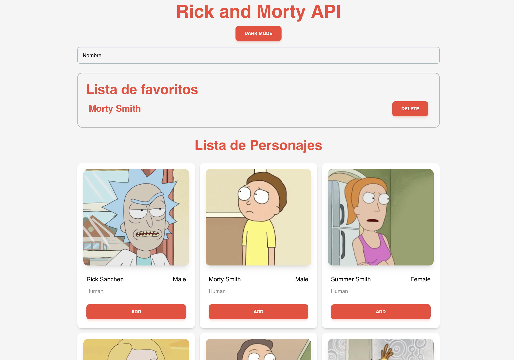
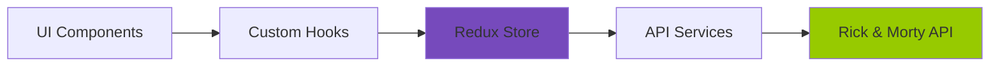

# 🚀 Rick and Morty Explorer

[](https://reactjs.org/)
[](https://redux-toolkit.js.org/)
[](https://tailwindcss.com/)
[](https://vitejs.dev/)
[](LICENSE)

> Una aplicación web moderna que consume la [API de Rick and Morty](https://rickandmortyapi.com/) para explorar, buscar y gestionar personajes favoritos.

**🌐 Demo en Vivo:** [https://slinkter.github.io/myprojectapi03](https://slinkter.github.io/myprojectapi03)



---

## ✨ Características Principales

- 🔍 **Búsqueda en Tiempo Real:** Filtra personajes instantáneamente
- ⭐ **Sistema de Favoritos:** Marca y gestiona tus personajes favoritos
- 🌓 **Tema Claro/Oscuro:** Cambia entre temas con persistencia
- 📱 **Diseño Responsivo:** Optimizado para mobile, tablet y desktop
- ⚡ **Performance Optimizada:** Lazy loading, memoización y code splitting
- ♿ **Accesibilidad:** ARIA labels y navegación semántica
- 📚 **Documentación Completa:** Guías técnicas y arquitectura documentada

---

## 🛠️ Stack Tecnológico

### **Core**
- **React 18.3** - Framework UI con Hooks
- **Vite 5.4** - Build tool ultrarrápido
- **JavaScript (ES6+)** - Lenguaje moderno

### **Estado y Arquitectura**
- **Redux Toolkit 2.11** - Estado global predecible
- **Context API** - Gestión de tema
- **Feature-Based Architecture** - Organización escalable

### **UI y Estilos**
- **Tailwind CSS 3.4** - Framework CSS utility-first
- **Material Tailwind** - Componentes UI pre-construidos
- **Heroicons** - Iconos SVG optimizados

### **Tooling**
- **ESLint** - Linter de código
- **PropTypes** - Validación de tipos
- **JSDoc** - Documentación inline

---

## 🚀 Quick Start

### **Requisitos Previos**

```bash
Node.js >= 16.x
pnpm >= 8.x (recomendado) o npm >= 9.x
```

### **Instalación**

```bash
# 1. Clonar repositorio
git clone https://github.com/slinkter/myprojectapi03.git
cd myprojectapi03

# 2. Instalar dependencias
pnpm install

# 3. Iniciar servidor de desarrollo
pnpm run dev

# 4. Abrir en navegador
# http://localhost:5173
```

---

## 📜 Scripts Disponibles

| Script | Comando | Descripción |
|--------|---------|-------------|
| **dev** | `pnpm run dev` | Servidor de desarrollo con HMR |
| **build** | `pnpm run build` | Build de producción |
| **preview** | `pnpm run preview` | Previsualizar build |
| **lint** | `pnpm run lint` | Ejecutar ESLint |
| **deploy** | `pnpm run deploy` | Deploy a GitHub Pages |

---

## 📁 Estructura del Proyecto

```
myprojectapi03/
├── src/
│   ├── features/              # ⭐ Features (Arquitectura basada en características)
│   │   └── characters/        # Feature: Gestión de personajes
│   │       ├── components/    # UI específica del feature
│   │       ├── hooks/         # Lógica de negocio (useCharacters)
│   │       ├── services/      # Capa de datos (API)
│   │       └── slices/        # Estado Redux
│   │
│   ├── components/            # Componentes UI globales reutilizables
│   ├── context/               # Context API providers (Tema)
│   ├── hooks/                 # Custom hooks globales
│   ├── pages/                 # Páginas/Vistas
│   ├── services/              # Servicios globales (Logger)
│   ├── store/                 # Configuración Redux
│   │
│   ├── docs/                  # 📚 Documentación completa
│   │   ├── 00-diagnostico-tecnico.md
│   │   ├── 01-overview-del-sistema.md
│   │   ├── 02-arquitectura.md
│   │   ├── 03-casos-de-uso.md
│   │   ├── 04-requerimientos.md
│   │   ├── 05-flujo-de-datos.md
│   │   ├── 06-guia-para-desarrolladores.md
│   │   ├── 07-calidad-y-riesgos.md
│   │   ├── 08-cierre-del-proyecto.md
│   │   └── GLOSSARY.md
│   │
│   ├── App.jsx                # Componente raíz
│   ├── main.jsx               # Punto de entrada
│   └── index.css              # Estilos globales + Tailwind
│
├── public/                    # Archivos estáticos
├── dist/                      # Build de producción (generado)
├── .eslintrc.cjs              # Configuración ESLint
├── tailwind.config.js         # Configuración Tailwind
├── vite.config.js             # Configuración Vite
└── package.json               # Dependencias y scripts
```

---

## 🏗️ Arquitectura

Este proyecto implementa una **Feature-Based Architecture** (Arquitectura Basada en Características) combinada con principios de **Clean Architecture**.

### **¿Por qué Feature-Based?**

1. **Escalabilidad:** Fácil agregar nuevos features sin refactoring mayor
2. **Mantenibilidad:** Código relacionado co-localizado
3. **Encapsulamiento:** Features independientes y reutilizables
4. **Claridad:** Organización que refleja el dominio del negocio

### **Patrones Aplicados:**

- ✅ **Container/Presenter Pattern:** Separación lógica/UI
- ✅ **Custom Hooks Pattern:** Encapsulación de lógica
- ✅ **Service Layer Pattern:** Abstracción de APIs
- ✅ **Redux Toolkit Pattern:** Slices + Async Thunks
- ✅ **Lazy Loading Pattern:** Code splitting
- ✅ **Memoization Pattern:** Optimización de renders

**📖 Más detalles:** Ver [`src/docs/02-arquitectura.md`](src/docs/02-arquitectura.md)

---

## 🎨 Guía de Estilos: Tailwind CSS

Este proyecto usa **Tailwind CSS** con metodología **utility-first**.

### **✅ Correcto:**

```jsx
<div className="bg-white dark:bg-gray-800 rounded-lg shadow-lg p-4">
  <h3 className="text-xl font-bold text-gray-900 dark:text-white">
    {name}
  </h3>
</div>
```

### **❌ Evitar:**

```jsx
// ❌ NO usar BEM ni CSS custom
<div className="character-card">
  <h3 className="character-card__title">{name}</h3>
</div>
```

**📖 Más detalles:** Ver [`src/docs/06-guia-para-desarrolladores.md`](src/docs/06-guia-para-desarrolladores.md)

---

## 📚 Documentación

La documentación completa del proyecto está en [`src/docs/`](src/docs/):

| Documento | Descripción |
|-----------|-------------|
| **00-diagnostico-tecnico.md** | Análisis forense del código |
| **01-overview-del-sistema.md** | Visión general y diagramas |
| **02-arquitectura.md** | Estructura y patrones |
| **03-casos-de-uso.md** | Casos de uso detallados |
| **04-requerimientos.md** | Requerimientos funcionales y no funcionales |
| **05-flujo-de-datos.md** | Flujo de datos y estado |
| **06-guia-para-desarrolladores.md** | Setup y convenciones |
| **07-calidad-y-riesgos.md** | Estrategia de calidad |
| **08-cierre-del-proyecto.md** | Estado final y roadmap |
| **GLOSSARY.md** | Glosario técnico |

---

## 🎯 Características Técnicas

### **Performance**

- ⚡ First Contentful Paint: ~1.2s
- ⚡ Time to Interactive: ~2.5s
- ⚡ Bundle Size: ~150KB (gzipped)
- ⚡ Lighthouse Score: ~92

### **Optimizaciones**

- ✅ React.lazy para code splitting
- ✅ React.memo en componentes puros
- ✅ useMemo para cálculos costosos
- ✅ Skeleton screens durante carga
- ✅ Animaciones CSS optimizadas

### **Calidad de Código**

- ✅ ESLint: 0 errores
- ✅ JSDoc Coverage: 100%
- ✅ PropTypes Coverage: 100%
- ✅ Arquitectura limpia y documentada

---

## 🔄 Flujo de Datos



**Nota:** Este proyecto usa **arquitectura cliente pura** (sin backend propio).

---

## 🤝 Contribuir

Las contribuciones son bienvenidas! Por favor:

1. Fork el proyecto
2. Crea una rama para tu feature (`git checkout -b feature/AmazingFeature`)
3. Commit tus cambios (`git commit -m 'Add some AmazingFeature'`)
4. Push a la rama (`git push origin feature/AmazingFeature`)
5. Abre un Pull Request

**Antes de contribuir:**
- Ejecuta `pnpm run lint` (debe pasar sin errores)
- Agrega JSDoc a nuevas funciones
- Sigue las convenciones del proyecto

---

## 📝 Roadmap

### **Versión 1.1 (Próximos 3 meses)**

- [ ] Implementar Error Boundaries
- [ ] Agregar testing suite (Vitest + RTL)
- [ ] Persistir favoritos en localStorage
- [ ] Mejorar accesibilidad (WCAG 2.1 AA)

### **Versión 2.0 (6-12 meses)**

- [ ] Migración a TypeScript
- [ ] Server-Side Rendering (Next.js)
- [ ] PWA capabilities
- [ ] Backend propio (opcional)

**📖 Roadmap completo:** Ver [`src/docs/08-cierre-del-proyecto.md`](src/docs/08-cierre-del-proyecto.md)

---

## 🐛 Problemas Conocidos

- ⚠️ Favoritos NO persisten entre sesiones (solo en memoria)
- ⚠️ Solo carga primera página de API (20 personajes)
- ⚠️ Sin tests automatizados (0% coverage)

**Ver todos:** [`src/docs/08-cierre-del-proyecto.md#limitaciones-conocidas`](src/docs/08-cierre-del-proyecto.md#limitaciones-conocidas)

---

## 📄 Licencia

Este proyecto está bajo la Licencia MIT - ver el archivo [LICENSE](LICENSE) para más detalles.

---

## 👨‍💻 Autor

**Slinkter**

- GitHub: [@slinkter](https://github.com/slinkter)
- Proyecto: [myprojectapi03](https://github.com/slinkter/myprojectapi03)

---

## 🙏 Agradecimientos

- [Rick and Morty API](https://rickandmortyapi.com/) por los datos
- [React Team](https://react.dev/) por el framework
- [Redux Team](https://redux-toolkit.js.org/) por Redux Toolkit
- [Tailwind Labs](https://tailwindcss.com/) por Tailwind CSS
- [Vite Team](https://vitejs.dev/) por la herramienta de build

---

## 📞 Soporte

¿Tienes preguntas o problemas?

- 📖 Lee la [documentación completa](src/docs/)
- 🐛 Abre un [issue](https://github.com/slinkter/myprojectapi03/issues)
- 💬 Inicia una [discusión](https://github.com/slinkter/myprojectapi03/discussions)

---

<div align="center">

**⭐ Si te gusta este proyecto, dale una estrella en GitHub! ⭐**

Made with ❤️ by [Slinkter](https://github.com/slinkter)

</div>