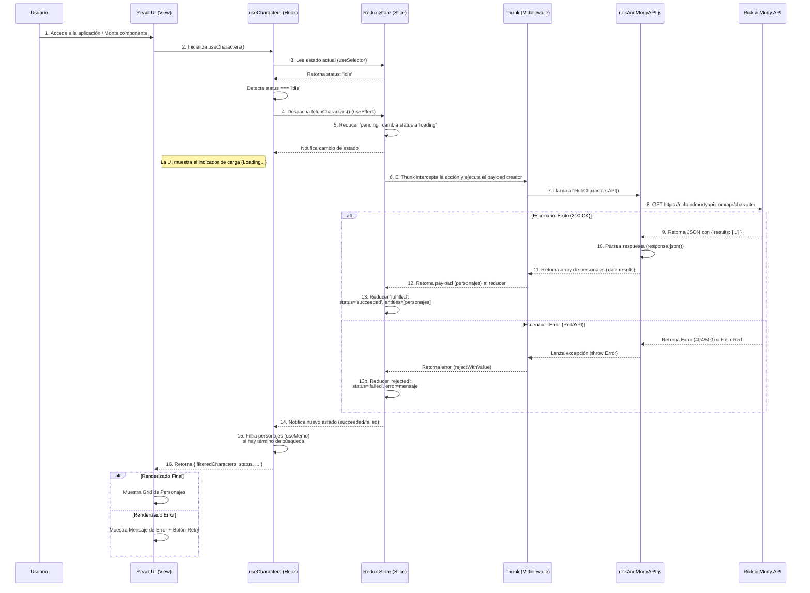

# Rick and Morty Explorer - React + Redux Toolkit + Tailwind CSS

## 1. Descripción General

Este proyecto es una aplicación web moderna construida con React que consume la API de Rick and Morty para mostrar un listado de personajes. La aplicación permite a los usuarios buscar personajes por nombre, añadirlos a una lista de favoritos y cambiar entre un tema claro y oscuro.

El objetivo principal de este proyecto es demostrar una arquitectura de frontend robusta y escalable utilizando **Redux Toolkit** para la gestión del estado, **Tailwind CSS** con metodología **BEM** para los estilos, y buenas prácticas de desarrollo.

## 2. Tecnologías Utilizadas

-   **React 18:** Biblioteca principal para la construcción de la interfaz de usuario.
-   **Vite:** Herramienta de build y servidor de desarrollo de alta velocidad.
-   **Redux Toolkit:** La forma oficial y recomendada de escribir lógica de Redux. Simplifica la configuración del store y la creación de slices.
-   **React-Redux:** Para conectar los componentes de React con el store de Redux.
-   **Tailwind CSS:** Framework CSS "utility-first" utilizado junto con la metodología BEM para un estilizado mantenible y escalable.
-   **Axios / Fetch API:** Para realizar peticiones HTTP a la API de Rick and Morty.
-   **ESLint:** Para mantener la calidad y consistencia del código.

## 3. Arquitectura y Flujo de Datos

El proyecto sigue una estructura organizada por capas técnicas y de dominio:

-   **`components/`**: Componentes de UI reutilizables (`CharacterCard`, `SearchBar`, `Header`, etc.).
-   **`hooks/`**: Custom hooks que encapsulan lógica de negocio y conexión con el store (`useCharacters`, `useTheme`).
-   **`store/`**: Configuración de Redux, incluyendo el store global y los slices (`characterSlice`).
-   **`services/`**: Capa de abstracción para las llamadas a la API externa.
-   **`pages/`**: Componentes de alto nivel que representan páginas completas.

### Diagrama de Flujo (Mermaid)

El siguiente diagrama ilustra el flujo de datos principal para la carga de personajes:



## 4. Estructura de Carpetas

```
/
├── public/
├── src/
│   ├── assets/             # Recursos estáticos (imágenes, iconos)
│   ├── components/         # Componentes de UI (CharacterCard, Header, etc.)
│   ├── context/            # Contextos de React (ThemeContext)
│   ├── hooks/              # Custom Hooks (useCharacters, useTheme)
│   ├── pages/              # Páginas de la aplicación
│   ├── services/           # Servicios de API (rickAndMortyAPI.js)
│   ├── store/              # Configuración de Redux
│   │   ├── slices/         # Slices de Redux (characterSlice)
│   │   └── store.js        # Configuración del store
│   ├── App.jsx             # Componente raíz
│   ├── index.css           # Estilos globales y clases BEM con Tailwind
│   └── main.jsx            # Punto de entrada
├── .eslintrc.cjs
├── package.json
├── tailwind.config.js      # Configuración de Tailwind CSS
└── vite.config.js          # Configuración de Vite
```

## 5. Características Principales

1.  **Listado de Personajes:** Carga y muestra personajes desde la API de Rick and Morty.
2.  **Búsqueda en Tiempo Real:** Filtra los personajes por nombre instantáneamente.
3.  **Favoritos:** Permite añadir y eliminar personajes de una lista de favoritos.
4.  **Modo Oscuro:** Soporte completo para tema claro y oscuro, persistente y automático.
5.  **Gestión de Estado Robusta:** Uso de Redux Toolkit para manejar estados asíncronos (loading, error, success) y síncronos (favoritos).
6.  **Estilos Escalables:** Implementación de metodología BEM sobre Tailwind CSS para mantener el CSS organizado y legible.

## 6. Instalación y Ejecución

1.  **Clonar el repositorio:**

    ```bash
    git clone <URL_DEL_REPOSITORIO>
    cd myprojectapi03
    ```

2.  **Instalar dependencias:**

    ```bash
    npm install
    # o si usas pnpm
    pnpm install
    ```

3.  **Ejecutar en modo de desarrollo:**
    ```bash
    npm run dev
    # o
    pnpm run dev
    ```
    La aplicación estará disponible en `http://localhost:5173`.

## 7. Documentación Adicional

Puedes encontrar diagramas detallados del flujo de la aplicación en la carpeta `docs/`.
