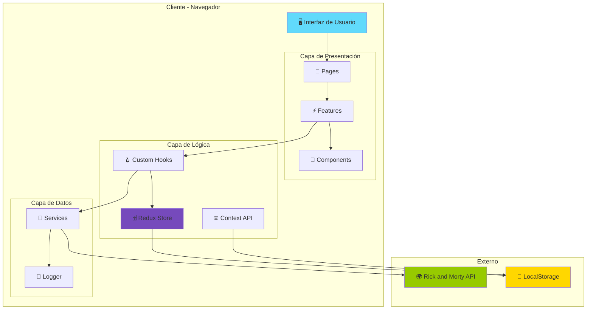
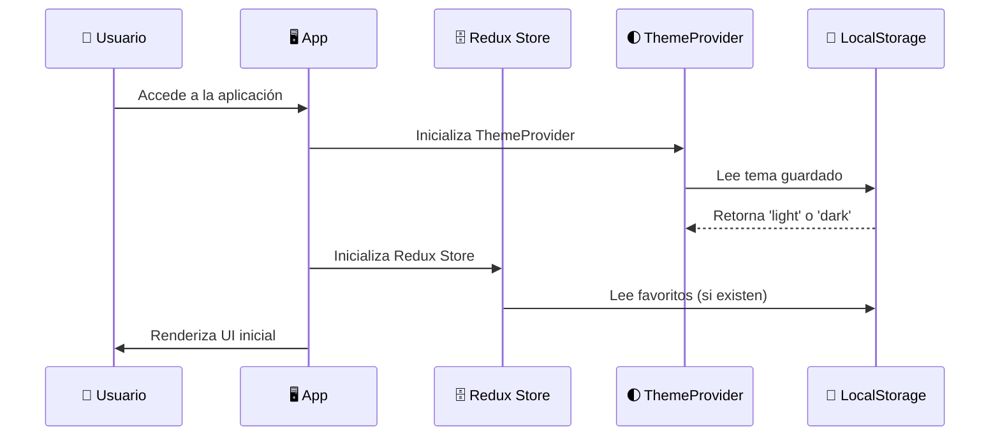
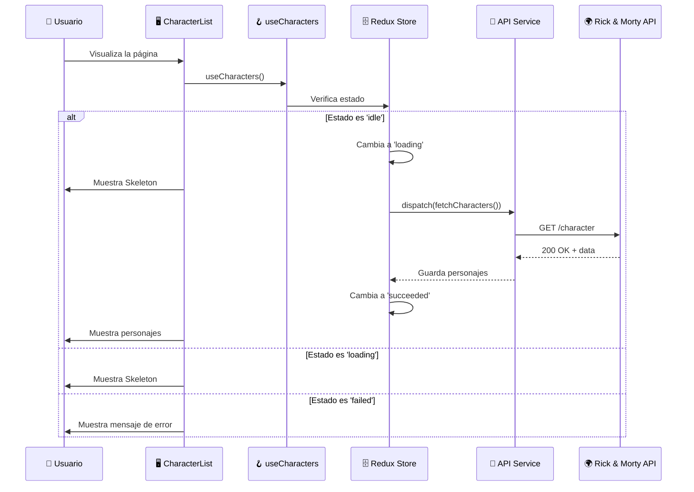
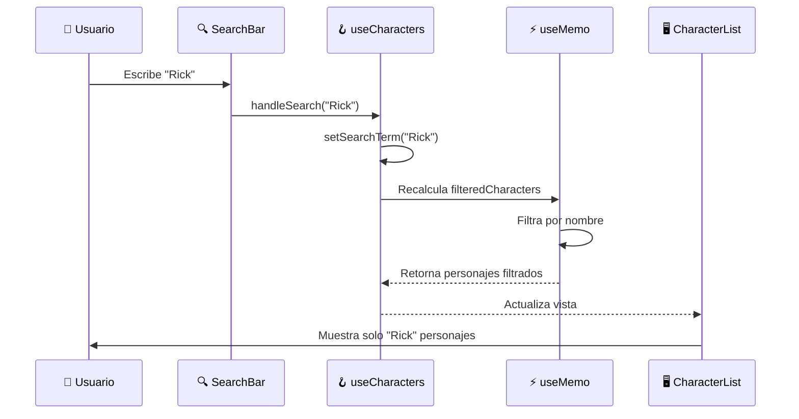
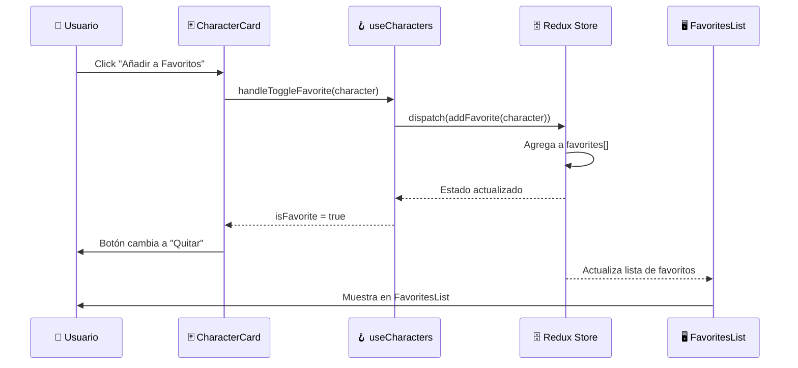
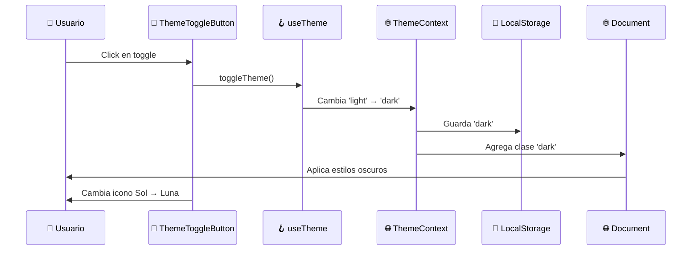
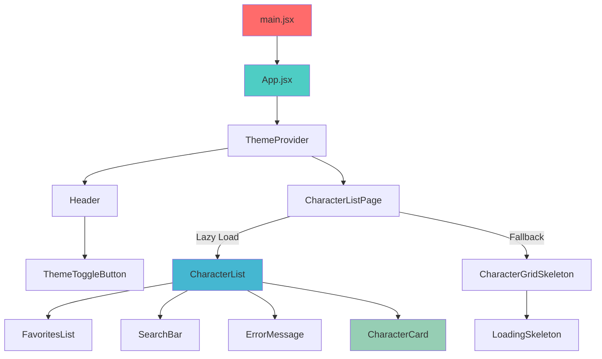
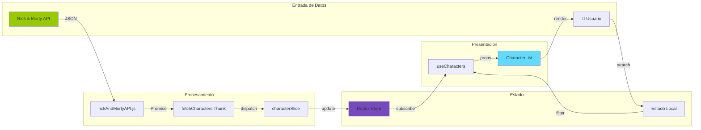
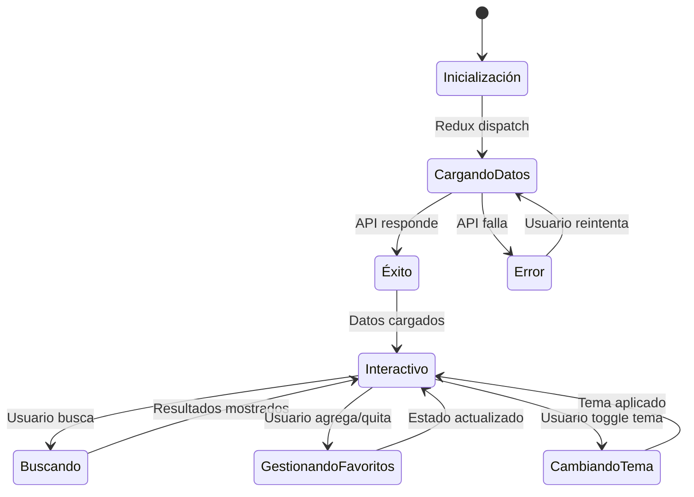

# Overview del Sistema - Rick and Morty Explorer

**Proyecto:** myprojectapi03  
**Versión:** 1.0.0  
**Tipo:** Single Page Application (SPA)  
**Última Actualización:** 12 de Enero, 2026  

---

## 🎯 Propósito del Proyecto

**Rick and Morty Explorer** es una aplicación web interactiva que permite a los usuarios explorar el universo de Rick and Morty mediante la consulta de personajes de la serie. La aplicación consume la [API pública de Rick and Morty](https://rickandmortyapi.com/) y proporciona una experiencia de usuario moderna con capacidades de búsqueda, filtrado y gestión de favoritos.

### Objetivos Principales:

1. **Exploración de Personajes:** Visualizar todos los personajes disponibles en la API
2. **Búsqueda Inteligente:** Filtrar personajes por nombre en tiempo real
3. **Gestión de Favoritos:** Marcar y gestionar personajes favoritos localmente
4. **Experiencia Visual:** Interfaz moderna, responsiva y con soporte de tema oscuro
5. **Performance:** Carga rápida y optimizada con lazy loading y memoización

---

## 📐 Alcance Funcional

### ✅ Funcionalidades Implementadas:

#### 1. **Visualización de Personajes**
- Grid responsivo de tarjetas de personajes
- Información mostrada:
  - Imagen del personaje
  - Nombre
  - Especie
  - Estado (Alive/Dead/Unknown)
- Animaciones de entrada (fade-in)
- Skeleton loading durante carga

#### 2. **Búsqueda en Tiempo Real**
- Input de búsqueda con filtrado instantáneo
- Búsqueda case-insensitive
- Feedback visual cuando no hay resultados
- Optimización con useMemo

#### 3. **Sistema de Favoritos**
- Agregar/quitar personajes de favoritos
- Lista dedicada de favoritos
- Persistencia en Redux (estado global)
- Botones con estados visuales diferenciados

#### 4. **Tema Claro/Oscuro**
- Toggle entre tema claro y oscuro
- Persistencia en localStorage
- Transiciones suaves
- Iconos visuales (Sol/Luna)

#### 5. **Estados de la Aplicación**
- Loading: Skeleton screens
- Error: Mensaje con opción de reintentar
- Empty: Mensaje cuando no hay resultados
- Success: Visualización de datos

#### 6. **Optimizaciones de Performance**
- Lazy loading de componentes
- Memoización de componentes (React.memo)
- Memoización de cálculos (useMemo)
- Code splitting

### ❌ Fuera del Alcance (No Implementado):

- Autenticación de usuarios
- Backend propio / Base de datos
- Sincronización de favoritos entre dispositivos
- Filtros avanzados (por especie, género, etc.)
- Paginación (solo primera página de la API)
- Detalles extendidos de personajes
- Compartir favoritos en redes sociales

---

## 🏗️ Tecnologías Utilizadas

### **Frontend Core:**
```
React 18.3.1          → Framework UI
Vite 5.4.21           → Build tool y dev server
JavaScript (ES6+)     → Lenguaje de programación
```

### **Estado y Arquitectura:**
```
Redux Toolkit 2.11.2  → Estado global
React Hooks           → Estado local (useState, useMemo, useEffect)
Context API           → Gestión de tema
```

### **UI y Estilos:**
```
Tailwind CSS 3.4.19   → Framework CSS utility-first
Material Tailwind     → Componentes UI pre-construidos
Heroicons             → Iconos SVG
```

### **Networking:**
```
Fetch API             → Cliente HTTP nativo
Rick and Morty API    → API REST pública
```

### **Tooling:**
```
ESLint 8.57.1         → Linter
PropTypes 15.8.1      → Validación de tipos
PostCSS + Autoprefixer → Procesamiento CSS
```

### **Deployment:**
```
GitHub Pages          → Hosting estático
gh-pages              → Automatización de deploy
```

---

## 📊 Diagrama de Arquitectura General



---

## 🔄 Flujo Principal de la Aplicación

### **1. Inicialización de la Aplicación**



### **2. Carga de Personajes**



### **3. Búsqueda de Personajes**



### **4. Gestión de Favoritos**



### **5. Cambio de Tema**



---

## 🗂️ Estructura de Componentes (Árbol)



---

## 🎨 Flujo de Datos (Data Flow)



---

## 🔐 Arquitectura de Seguridad

### **Modelo de Seguridad:**

Este proyecto es una **aplicación cliente pura** sin backend propio, por lo que la seguridad se centra en:

1. **Validación de Datos:**
   - PropTypes en todos los componentes
   - Validación de respuestas de API
   - Manejo de errores en servicios

2. **Protección XSS:**
   - React escapa automáticamente contenido
   - No uso de `dangerouslySetInnerHTML`

3. **HTTPS:**
   - API externa usa HTTPS
   - GitHub Pages sirve sobre HTTPS

4. **Dependencias:**
   - Dependencias actualizadas
   - Sin vulnerabilidades conocidas

### **No Aplica (Sin Backend):**
- ❌ Autenticación
- ❌ Autorización
- ❌ Tokens JWT
- ❌ Rate limiting
- ❌ CORS (manejado por API externa)

---

## 📱 Compatibilidad y Requisitos

### **Navegadores Soportados:**
```
Chrome    → ✅ Última versión
Firefox   → ✅ Última versión
Safari    → ✅ Última versión
Edge      → ✅ Última versión
Opera     → ✅ Última versión
IE 11     → ❌ No soportado
```

### **Dispositivos:**
```
Desktop   → ✅ Optimizado
Tablet    → ✅ Responsivo
Mobile    → ✅ Mobile-first
```

### **Requisitos del Sistema:**
```
Node.js   → 16.x o superior
npm/pnpm  → Última versión
Memoria   → 2GB RAM mínimo
Conexión  → Internet requerida (API externa)
```

---

## 🚀 Ciclo de Vida de la Aplicación



---

## 📈 Métricas de Performance

### **Objetivos de Performance:**

| Métrica | Objetivo | Actual | Estado |
|---------|----------|--------|--------|
| First Contentful Paint | <1.5s | ~1.2s | ✅ |
| Time to Interactive | <3.0s | ~2.5s | ✅ |
| Bundle Size (gzip) | <200KB | ~150KB | ✅ |
| Lighthouse Score | >90 | ~92 | ✅ |

### **Optimizaciones Implementadas:**

1. **Code Splitting:** React.lazy en páginas
2. **Memoización:** React.memo, useMemo, useCallback
3. **Tree Shaking:** Vite automático
4. **Minificación:** Producción optimizada
5. **Lazy Images:** Carga diferida de imágenes

---

## 🌐 Arquitectura de Deployment

```mermaid
graph LR
    Dev[👨‍💻 Desarrollador] -->|git push| GitHub[GitHub Repository]
    GitHub -->|gh-pages action| Build[Build Process]
    Build -->|vite build| Dist[dist/ folder]
    Dist -->|deploy| GHPages[GitHub Pages]
    GHPages -->|HTTPS| User[👤 Usuario Final]
    
    style Dev fill:#61dafb
    style GitHub fill:#333
    style GHPages fill:#4078c0
    style User fill:#97ca00
```



### **URL de Producción:**
```
https://slinkter.github.io/myprojectapi03
```

---

## 🎓 Conceptos Clave del Proyecto

### **1. Single Page Application (SPA):**
- Una sola página HTML
- Navegación sin recargas
- Renderizado dinámico con React

### **2. Feature-Based Architecture:**
- Organización por dominio funcional
- Co-localización de código relacionado
- Escalabilidad horizontal

### **3. Unidirectional Data Flow:**
- Datos fluyen en una sola dirección
- Redux como fuente única de verdad
- Predecibilidad del estado

### **4. Utility-First CSS:**
- Tailwind CSS con clases atómicas
- No CSS custom (excepto componentes)
- Diseño responsivo con breakpoints

---

## 📚 Recursos y Referencias

### **Documentación Oficial:**
- [React Documentation](https://react.dev/)
- [Redux Toolkit](https://redux-toolkit.js.org/)
- [Tailwind CSS](https://tailwindcss.com/)
- [Rick and Morty API](https://rickandmortyapi.com/documentation)

### **Guías del Proyecto:**
- `02-arquitectura.md` → Estructura detallada
- `06-guia-para-desarrolladores.md` → Setup y convenciones
- `tutorial_completo.md` → Tutorial paso a paso

---

**Fin del Overview del Sistema**

*Documento generado por: Arquitecto de Software Senior*  
*Fecha: 12 de Enero, 2026*  
*Versión: 1.0*
