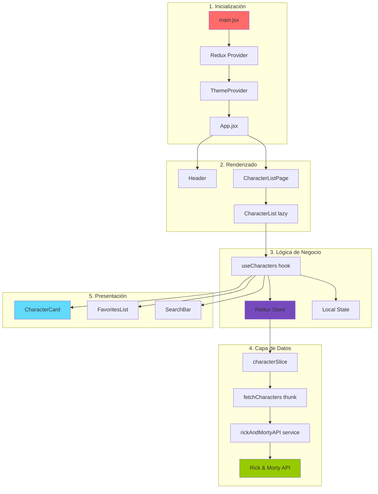
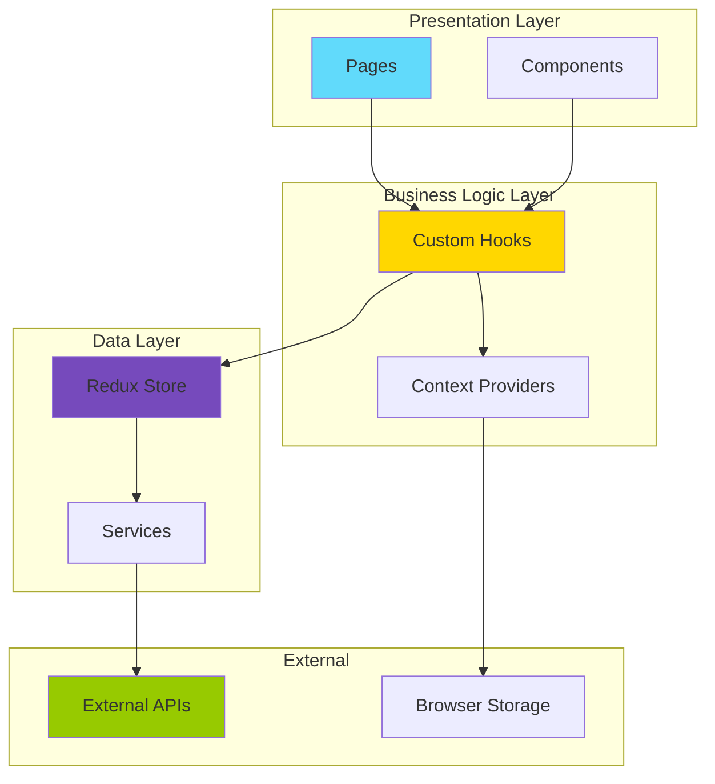

# Arquitectura del Sistema - Rick and Morty Explorer

**Proyecto:** myprojectapi03  
**Arquitectura:** Feature-Based + Clean Architecture  
**Fecha:** 12 de Enero, 2026  

---

## 🏗️ Filosofía Arquitectónica

Este proyecto implementa una **Feature-Based Architecture** (Arquitectura Basada en Características) combinada con principios de **Clean Architecture**. Esta decisión arquitectónica se tomó para:

1. **Escalabilidad:** Facilitar el crecimiento del proyecto sin crear "carpetas cajón de sastre"
2. **Mantenibilidad:** Co-localizar código relacionado para facilitar cambios
3. **Encapsulamiento:** Aislar features para reducir acoplamiento
4. **Claridad:** Organización intuitiva que refleja el dominio del negocio

### **Principios SOLID Aplicados:**

| Principio | Aplicación en el Proyecto |
|-----------|---------------------------|
| **S**ingle Responsibility | Cada componente/hook tiene una única responsabilidad |
| **O**pen/Closed | Componentes extensibles vía props, cerrados a modificación |
| **L**iskov Substitution | N/A (no usamos herencia) |
| **I**nterface Segregation | Props interfaces mínimas y enfocadas |
| **D**ependency Inversion | Hooks y servicios dependen de abstracciones |

---

## 📁 Estructura de Carpetas Completa

```
myprojectapi03/
├── 📄 .eslintrc.cjs              # Configuración ESLint
├── 📄 .gitignore                 # Archivos ignorados por Git
├── 📄 index.html                 # HTML raíz (SPA)
├── 📄 jsconfig.json              # Configuración alias @
├── 📄 package.json               # Dependencias y scripts
├── 📄 pnpm-lock.yaml             # Lock file de pnpm
├── 📄 postcss.config.js          # Configuración PostCSS
├── 📄 README.md                  # Documentación principal
├── 📄 tailwind.config.js         # Configuración Tailwind
├── 📄 vite.config.js             # Configuración Vite
├── 📄 TECHNICAL_DIAGNOSIS.md     # Diagnóstico técnico (legacy)
│
├── 📂 public/                    # Archivos estáticos
│   └── 📄 vite.svg               # Favicon
│
├── 📂 dist/                      # Build de producción (generado)
│   ├── 📂 assets/                # JS/CSS compilados
│   └── 📄 index.html             # HTML procesado
│
└── 📂 src/                       # Código fuente
    ├── 📄 main.jsx               # Punto de entrada
    ├── 📄 App.jsx                # Componente raíz
    ├── 📄 index.css              # Estilos globales + Tailwind
    │
    ├── 📂 features/              # ⭐ FEATURES (Módulos de Dominio)
    │   └── 📂 characters/        # Feature: Gestión de personajes
    │       ├── 📂 components/    # UI específica del feature
    │       │   ├── CharacterCard.jsx
    │       │   ├── CharacterList.jsx
    │       │   ├── CharacterGridSkeleton.jsx
    │       │   └── FavoritesList.jsx
    │       ├── 📂 hooks/         # Lógica de negocio
    │       │   └── useCharacters.js
    │       ├── 📂 services/      # Capa de datos
    │       │   └── rickAndMortyAPI.js
    │       └── 📂 slices/        # Estado Redux
    │           └── characterSlice.js
    │
    ├── 📂 components/            # Componentes UI globales reutilizables
    │   ├── ErrorMessage.jsx      # Mensaje de error genérico
    │   ├── Header.jsx            # Encabezado de la app
    │   ├── LoadingSkeleton.jsx   # Skeleton loader genérico
    │   ├── SearchBar.jsx         # Barra de búsqueda
    │   └── ThemeToggleButton.jsx # Botón de cambio de tema
    │
    ├── 📂 context/               # Context API providers
    │   ├── ThemeContext.js       # Definición del contexto
    │   └── ThemeProvider.jsx     # Proveedor de tema
    │
    ├── 📂 hooks/                 # Custom hooks globales
    │   └── useTheme.js           # Hook para consumir ThemeContext
    │
    ├── 📂 pages/                 # Páginas/Vistas de la aplicación
    │   └── CharacterListPage.jsx # Página principal
    │
    ├── 📂 services/              # Servicios globales
    │   └── logger.js             # Servicio de logging centralizado
    │
    ├── 📂 store/                 # Configuración Redux
    │   └── store.js              # Store principal
    │
    ├── 📂 assets/                # Recursos estáticos
    │   └── react.svg             # Logo de React
    │
    └── 📂 docs/                  # 📚 DOCUMENTACIÓN
        ├── 00-diagnostico-tecnico.md
        ├── 01-overview-del-sistema.md
        ├── 02-arquitectura.md (este archivo)
        ├── 03-casos-de-uso.md
        ├── 04-requerimientos.md
        ├── 05-flujo-de-datos.md
        ├── 06-guia-para-desarrolladores.md
        ├── 07-calidad-y-riesgos.md
        ├── 08-cierre-del-proyecto.md
        ├── tutorial_completo.md
        └── GLOSSARY.md
```

---

## 🎯 Responsabilidad de Cada Capa

### **1. Features Layer (Capa de Características)**

**Ubicación:** `src/features/`

**Propósito:** Encapsular toda la funcionalidad relacionada con un dominio específico.

**Estructura de un Feature:**

```
features/
└── [nombre-feature]/
    ├── components/     # UI específica del feature
    ├── hooks/          # Lógica de negocio (View-Controllers)
    ├── services/       # Comunicación con APIs/datos
    └── slices/         # Estado Redux específico
```

**Ejemplo: Feature `characters`**

```javascript
// features/characters/hooks/useCharacters.js
// ✅ Encapsula TODA la lógica de negocio del feature
export const useCharacters = () => {
  // Estado Redux
  const { entities, favorites, status, error } = useSelector(/*...*/);
  
  // Estado local
  const [searchTerm, setSearchTerm] = useState("");
  
  // Lógica de filtrado
  const filteredCharacters = useMemo(/*...*/);
  
  // Handlers
  const handleToggleFavorite = (character) => {/*...*/};
  
  // Retorna interfaz pública
  return { filteredCharacters, favorites, handleToggleFavorite, /*...*/ };
};
```

**Reglas:**
- ✅ Un feature NO debe importar de otro feature
- ✅ Puede importar de `components/`, `hooks/`, `services/` globales
- ✅ Auto-contenido: todo lo necesario está dentro del feature

---

### **2. Components Layer (Capa de Componentes Globales)**

**Ubicación:** `src/components/`

**Propósito:** Componentes UI **reutilizables** que NO pertenecen a un feature específico.

**Criterios para estar aquí:**
- ✅ Usado en múltiples features
- ✅ Genérico y configurable vía props
- ✅ Sin lógica de negocio específica
- ✅ Presentacional (dumb component)

**Ejemplos:**

```javascript
// components/SearchBar.jsx
// ✅ Genérico: puede buscar cualquier cosa
export function SearchBar({ value, onChange }) {
  return <input value={value} onChange={(e) => onChange(e.target.value)} />;
}

// components/ErrorMessage.jsx
// ✅ Genérico: muestra cualquier error
export const ErrorMessage = ({ message, onRetry }) => {
  return (
    <div>
      <p>{message}</p>
      <button onClick={onRetry}>Reintentar</button>
    </div>
  );
};
```

---

### **3. Context Layer (Capa de Contexto)**

**Ubicación:** `src/context/`

**Propósito:** Gestionar estado global mediante Context API (alternativa a Redux para estado UI).

**Cuándo usar Context vs Redux:**

| Caso de Uso | Solución |
|-------------|----------|
| Estado UI (tema, idioma) | ✅ Context API |
| Estado de negocio (datos, entidades) | ✅ Redux |
| Preferencias de usuario | ✅ Context API |
| Datos de API | ✅ Redux |

**Estructura:**

```javascript
// context/ThemeContext.js
// ✅ Define el contrato
export const ThemeContext = createContext(null);

// context/ThemeProvider.jsx
// ✅ Implementa la lógica
export const ThemeProvider = ({ children }) => {
  const [theme, setTheme] = useState('light');
  const toggleTheme = () => setTheme(prev => prev === 'light' ? 'dark' : 'light');
  
  return (
    <ThemeContext.Provider value={{ theme, toggleTheme }}>
      {children}
    </ThemeContext.Provider>
  );
};
```

---

### **4. Hooks Layer (Capa de Hooks Globales)**

**Ubicación:** `src/hooks/`

**Propósito:** Custom hooks reutilizables que NO pertenecen a un feature.

**Ejemplos:**

```javascript
// hooks/useTheme.js
// ✅ Hook para consumir ThemeContext
export const useTheme = () => {
  const context = useContext(ThemeContext);
  if (!context) {
    throw new Error('useTheme must be used within ThemeProvider');
  }
  return context;
};

// Posibles hooks globales futuros:
// hooks/useDebounce.js
// hooks/useLocalStorage.js
// hooks/useMediaQuery.js
```

---

### **5. Pages Layer (Capa de Páginas)**

**Ubicación:** `src/pages/`

**Propósito:** Componentes que representan rutas/vistas completas de la aplicación.

**Características:**
- ✅ Punto de entrada de una ruta
- ✅ Orquesta features y componentes
- ✅ Mínima lógica (solo composición)
- ✅ Lazy loading aplicado aquí

**Ejemplo:**

```javascript
// pages/CharacterListPage.jsx
// ✅ Página que orquesta el feature characters
const CharacterList = React.lazy(() => 
  import("@/features/characters/components/CharacterList")
);

export const CharacterListPage = () => (
  <Suspense fallback={<CharacterGridSkeleton />}>
    <CharacterList />
  </Suspense>
);
```

---

### **6. Services Layer (Capa de Servicios)**

**Ubicación:** `src/services/` (global) y `src/features/[feature]/services/` (específico)

**Propósito:** Abstraer comunicación con APIs, logging, analytics, etc.

**Principios:**
- ✅ Ocultar detalles de implementación
- ✅ Retornar datos normalizados
- ✅ Manejar errores internamente
- ✅ Facilitar testing (mocking)

**Ejemplo:**

```javascript
// features/characters/services/rickAndMortyAPI.js
// ✅ Abstrae la API externa
export const fetchCharacters = async () => {
  try {
    const response = await fetch(`${API_BASE_URL}/character`);
    if (!response.ok) throw new Error(`HTTP ${response.status}`);
    const data = await response.json();
    return data.results; // ✅ Retorna solo lo necesario
  } catch (error) {
    logger.apiError('/character', error);
    throw error; // ✅ Re-lanza para que Redux lo maneje
  }
};
```

---

### **7. Store Layer (Capa de Estado Global)**

**Ubicación:** `src/store/` (configuración) y `src/features/[feature]/slices/` (slices)

**Propósito:** Gestionar estado global de la aplicación con Redux Toolkit.

**Arquitectura Redux:**

```javascript
// store/store.js
// ✅ Configuración central
export const store = configureStore({
  reducer: {
    characters: characterReducer,
    // Futuros reducers aquí
  },
});

// features/characters/slices/characterSlice.js
// ✅ Slice específico del feature
const characterSlice = createSlice({
  name: 'characters',
  initialState: { entities: [], favorites: [], status: 'idle', error: null },
  reducers: {
    addFavorite: (state, action) => { /*...*/ },
    removeFavorite: (state, action) => { /*...*/ },
  },
  extraReducers: (builder) => {
    builder
      .addCase(fetchCharacters.pending, (state) => { /*...*/ })
      .addCase(fetchCharacters.fulfilled, (state, action) => { /*...*/ })
      .addCase(fetchCharacters.rejected, (state, action) => { /*...*/ });
  },
});
```

---

## 🎨 Patrones de Diseño Aplicados

### **1. Feature-Based Architecture**

**Problema:** Carpetas genéricas (`components/`, `utils/`) se vuelven inmanejables.

**Solución:** Organizar por dominio funcional.

**Beneficios:**
- ✅ Escalabilidad horizontal
- ✅ Código co-localizado
- ✅ Fácil de entender y modificar

---

### **2. Container/Presenter Pattern**

**Problema:** Componentes con lógica y UI mezcladas.

**Solución:** Separar lógica (hooks) de presentación (componentes).

**Ejemplo:**

```javascript
// ✅ CONTAINER (Lógica)
// hooks/useCharacters.js
export const useCharacters = () => {
  // Toda la lógica aquí
  return { data, handlers };
};

// ✅ PRESENTER (UI)
// components/CharacterList.jsx
export const CharacterList = () => {
  const { data, handlers } = useCharacters(); // Consume lógica
  return <div>{/* Solo JSX */}</div>;
};
```

---

### **3. Custom Hooks Pattern**

**Problema:** Lógica duplicada entre componentes.

**Solución:** Extraer lógica a custom hooks reutilizables.

**Ejemplo:**

```javascript
// ✅ Hook reutilizable
export const useCharacters = () => {
  const dispatch = useDispatch();
  const { entities, status } = useSelector(state => state.characters);
  
  useEffect(() => {
    if (status === 'idle') {
      dispatch(fetchCharacters());
    }
  }, [status, dispatch]);
  
  return { entities, status };
};
```

---

### **4. Service Layer Pattern**

**Problema:** Componentes acoplados a detalles de API.

**Solución:** Abstraer comunicación en servicios.

**Beneficios:**
- ✅ Fácil cambiar de API
- ✅ Testing simplificado
- ✅ Centralización de lógica de red

---

### **5. Redux Toolkit Pattern (Slices + Thunks)**

**Problema:** Redux tradicional es verboso.

**Solución:** Redux Toolkit con slices y async thunks.

**Ejemplo:**

```javascript
// ✅ Async Thunk
export const fetchCharacters = createAsyncThunk(
  'characters/fetchCharacters',
  async (_, { rejectWithValue }) => {
    try {
      return await fetchCharactersAPI();
    } catch (error) {
      return rejectWithValue(error.message);
    }
  }
);

// ✅ Slice con extraReducers
const characterSlice = createSlice({
  name: 'characters',
  initialState,
  reducers: { /* sync actions */ },
  extraReducers: (builder) => {
    builder
      .addCase(fetchCharacters.pending, (state) => { state.status = 'loading'; })
      .addCase(fetchCharacters.fulfilled, (state, action) => { 
        state.entities = action.payload;
        state.status = 'succeeded';
      });
  },
});
```

---

### **6. Lazy Loading Pattern**

**Problema:** Bundle inicial muy grande.

**Solución:** Code splitting con React.lazy.

**Ejemplo:**

```javascript
// ✅ Lazy loading de página
const CharacterList = React.lazy(() => 
  import("@/features/characters/components/CharacterList")
);

export const CharacterListPage = () => (
  <Suspense fallback={<Skeleton />}>
    <CharacterList />
  </Suspense>
);
```

---

### **7. Memoization Pattern**

**Problema:** Re-renders innecesarios.

**Solución:** React.memo, useMemo, useCallback.

**Ejemplo:**

```javascript
// ✅ Componente memoizado
export const CharacterCard = React.memo(({ character, onToggle }) => {
  return <div>{/* UI */}</div>;
});

// ✅ Cálculo memoizado
const filteredCharacters = useMemo(() => {
  return entities.filter(char => 
    char.name.toLowerCase().includes(searchTerm.toLowerCase())
  );
}, [entities, searchTerm]);
```

---

## 🔄 Flujo de Datos Detallado



---

## 📦 Gestión de Dependencias

### **Dependencias de Producción:**

```json
{
  "@heroicons/react": "^2.2.0",           // Iconos SVG
  "@material-tailwind/react": "^2.1.10",  // Componentes UI
  "@reduxjs/toolkit": "^2.11.2",          // Estado global
  "prop-types": "^15.8.1",                // Validación de tipos
  "react": "^18.3.1",                     // Framework UI
  "react-dom": "^18.3.1",                 // DOM renderer
  "react-redux": "^9.2.0"                 // Bindings Redux
}
```

### **Dependencias de Desarrollo:**

```json
{
  "@vitejs/plugin-react": "^4.7.0",      // Plugin Vite para React
  "autoprefixer": "^10.4.23",            // Prefijos CSS automáticos
  "eslint": "^8.57.1",                   // Linter
  "eslint-plugin-react": "^7.37.5",      // Reglas React
  "gh-pages": "^6.3.0",                  // Deploy a GitHub Pages
  "postcss": "^8.5.6",                   // Procesador CSS
  "tailwindcss": "^3.4.19",              // Framework CSS
  "vite": "^5.4.21"                      // Build tool
}
```

---

## 🔧 Configuraciones Clave

### **1. Alias de Importación (`@`)**

**Archivo:** `jsconfig.json` + `vite.config.js`

```javascript
// jsconfig.json
{
  "compilerOptions": {
    "baseUrl": ".",
    "paths": {
      "@/*": ["src/*"]
    }
  }
}

// vite.config.js
export default defineConfig({
  resolve: {
    alias: {
      "@": "/src",
    },
  },
});
```

**Beneficios:**
- ✅ Imports limpios: `import { X } from '@/components/X'`
- ✅ Sin rutas relativas: `../../../components/X`
- ✅ Refactoring más fácil

---

### **2. Tailwind CSS Configuration**

**Archivo:** `tailwind.config.js`

```javascript
module.exports = withMT({
  darkMode: 'class', // ✅ Dark mode con clase
  content: ["./index.html", "./src/**/*.{js,jsx}"],
  theme: {
    extend: {
      fontFamily: {
        sans: ['Inter', ...defaultTheme.fontFamily.sans],
      },
      colors: {
        primary: '#06b6d4',        // cyan-500
        secondary: '#64748b',      // slate-500
        accent: '#ef4444',         // red-500
      },
      animation: {
        'fade-in': 'fadeIn 0.5s ease-out',
      },
    },
  },
});
```

---

### **3. ESLint Configuration**

**Archivo:** `.eslintrc.cjs`

```javascript
module.exports = {
  root: true,
  env: { browser: true, es2020: true, node: true },
  extends: [
    'eslint:recommended',
    'plugin:react/recommended',
    'plugin:react/jsx-runtime',
    'plugin:react-hooks/recommended',
  ],
  ignorePatterns: ['dist', 'tailwind.config.js', 'postcss.config.js'],
  rules: {
    'react-refresh/only-export-components': ['warn', { allowConstantExport: true }],
  },
};
```

---

## 🚀 Estrategia de Escalabilidad

### **Agregar un Nuevo Feature:**

```bash
# 1. Crear estructura
src/features/[nuevo-feature]/
├── components/
├── hooks/
├── services/
└── slices/

# 2. Crear slice Redux
src/features/[nuevo-feature]/slices/[feature]Slice.js

# 3. Registrar en store
// store/store.js
import newFeatureReducer from '@/features/[nuevo-feature]/slices/[feature]Slice';

export const store = configureStore({
  reducer: {
    characters: characterReducer,
    newFeature: newFeatureReducer, // ✅ Agregar aquí
  },
});

# 4. Crear página
src/pages/[NewFeature]Page.jsx

# 5. Lazy load
const NewFeature = React.lazy(() => import('@/features/[nuevo-feature]/components/Main'));
```

---

## 📊 Diagrama de Capas (Clean Architecture)



---

**Fin de la Documentación de Arquitectura**

*Documento generado por: Arquitecto de Software Senior*  
*Fecha: 12 de Enero, 2026*  
*Versión: 1.0*
