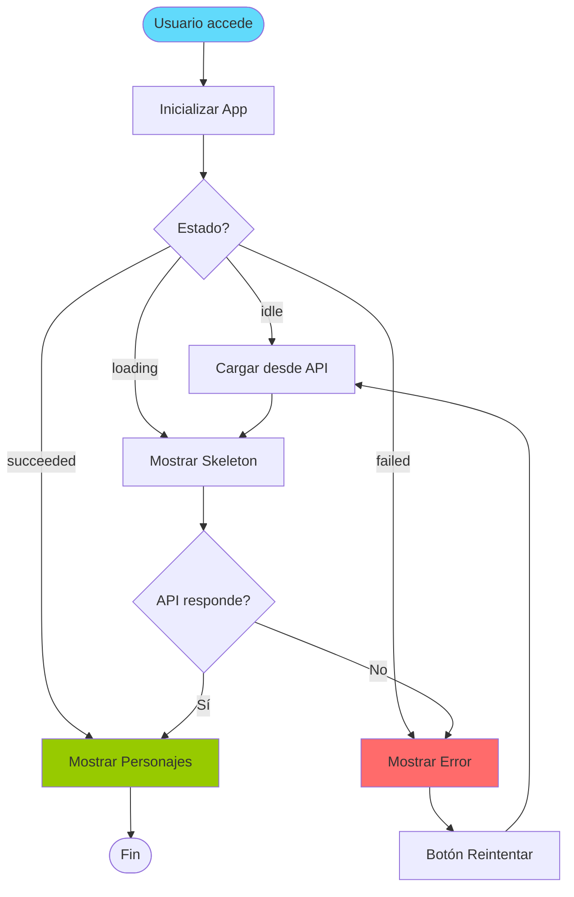
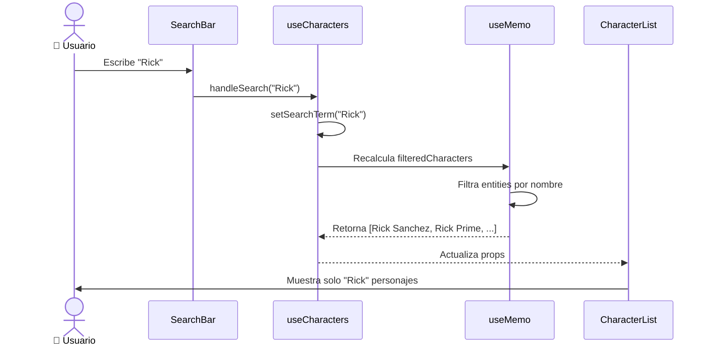
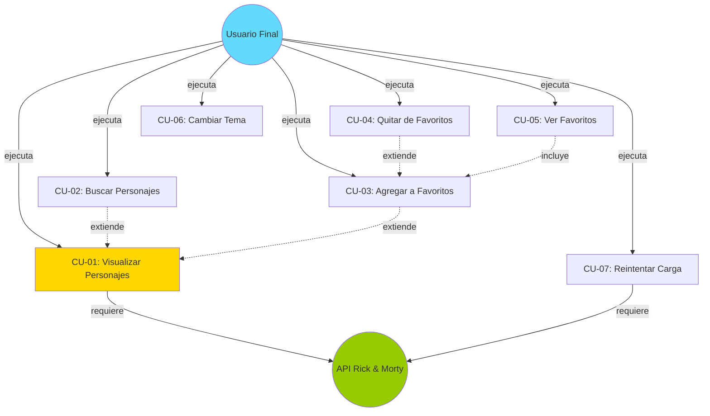

# Casos de Uso - Rick and Morty Explorer

**Proyecto:** myprojectapi03  
**Fecha:** 12 de Enero, 2026  
**Versión:** 1.0  

---

## 👥 Actores del Sistema

| Actor | Descripción | Rol |
|-------|-------------|-----|
| **Usuario Final** | Persona que usa la aplicación para explorar personajes | Principal |
| **API de Rick and Morty** | Sistema externo que provee datos de personajes | Secundario |
| **Navegador Web** | Cliente que ejecuta la aplicación | Sistema |

---

## 📋 Lista de Casos de Uso

### **Casos de Uso Principales:**

| ID | Caso de Uso | Prioridad | Estado |
|----|-------------|-----------|--------|
| CU-01 | Visualizar Lista de Personajes | Alta | ✅ Implementado |
| CU-02 | Buscar Personajes por Nombre | Alta | ✅ Implementado |
| CU-03 | Agregar Personaje a Favoritos | Media | ✅ Implementado |
| CU-04 | Quitar Personaje de Favoritos | Media | ✅ Implementado |
| CU-05 | Ver Lista de Favoritos | Media | ✅ Implementado |
| CU-06 | Cambiar Tema (Claro/Oscuro) | Baja | ✅ Implementado |
| CU-07 | Reintentar Carga en Caso de Error | Media | ✅ Implementado |

---

## 📖 Casos de Uso Detallados

---

### **CU-01: Visualizar Lista de Personajes**

**Actor Principal:** Usuario Final  
**Precondiciones:**  
- El usuario tiene acceso a internet
- La API de Rick and Morty está disponible

**Flujo Principal:**

1. El usuario accede a la aplicación
2. El sistema inicia la carga de personajes desde la API
3. El sistema muestra skeleton screens mientras carga
4. El sistema recibe los datos de la API
5. El sistema renderiza las tarjetas de personajes en un grid responsivo
6. Cada tarjeta muestra:
   - Imagen del personaje
   - Nombre
   - Especie
   - Estado (Alive/Dead/Unknown)
   - Botón para agregar a favoritos
7. El usuario visualiza la lista completa

**Flujos Alternativos:**

**FA-01: Error de Red**
- 3a. La API no responde o retorna error
- 3b. El sistema muestra mensaje de error
- 3c. El sistema ofrece botón "Reintentar"
- 3d. El usuario puede reintentar la carga (ver CU-07)

**FA-02: Sin Conexión**
- 1a. El usuario no tiene conexión a internet
- 1b. El sistema muestra mensaje de error de red
- 1c. El caso de uso termina

**Postcondiciones:**
- Los personajes se muestran en pantalla
- El estado de carga se marca como "succeeded"
- Los datos se almacenan en Redux Store

**Reglas de Negocio:**
- RN-01: Solo se carga la primera página de resultados (20 personajes)
- RN-02: Las imágenes se cargan de forma lazy
- RN-03: El grid es responsivo: 1 col (mobile), 2 (tablet), 3-4 (desktop)

**Diagrama de Flujo:**

---

### **CU-02: Buscar Personajes por Nombre**

**Actor Principal:** Usuario Final  
**Precondiciones:**  
- Los personajes ya están cargados (CU-01 completado)

**Flujo Principal:**

1. El usuario visualiza la lista de personajes
2. El usuario hace clic en el input de búsqueda
3. El usuario escribe un término de búsqueda (ej: "Rick")
4. El sistema filtra los personajes en tiempo real
5. El sistema muestra solo los personajes que coinciden
6. El contador de resultados se actualiza

**Flujos Alternativos:**

**FA-01: Sin Resultados**
- 5a. Ningún personaje coincide con la búsqueda
- 5b. El sistema muestra mensaje: "No se encontraron personajes con ese nombre [término]"
- 5c. El usuario puede modificar la búsqueda

**FA-02: Búsqueda Vacía**
- 3a. El usuario borra el término de búsqueda
- 3b. El sistema muestra todos los personajes nuevamente

**Postcondiciones:**
- La lista se filtra según el término
- El estado de búsqueda se actualiza

**Reglas de Negocio:**
- RN-04: La búsqueda es case-insensitive
- RN-05: La búsqueda es en tiempo real (sin botón "Buscar")
- RN-06: Se busca solo por nombre, no por especie u otros campos

**Diagrama de Secuencia:**

---

### **CU-03: Agregar Personaje a Favoritos**

**Actor Principal:** Usuario Final  
**Precondiciones:**  
- Los personajes están cargados
- El personaje NO está en favoritos

**Flujo Principal:**

1. El usuario visualiza una tarjeta de personaje
2. El usuario hace clic en "Añadir a Favoritos"
3. El sistema agrega el personaje al estado de favoritos
4. El botón cambia a "Quitar de Favoritos" (color rojo)
5. El personaje aparece en la lista de favoritos superior
6. El sistema muestra animación de fade-in en la lista

**Flujos Alternativos:**

**FA-01: Personaje Ya en Favoritos**
- 2a. El personaje ya está en favoritos (no debería pasar)
- 2b. El sistema no hace nada (validación en reducer)

**Postcondiciones:**
- El personaje se agrega al array `favorites` en Redux
- La UI se actualiza para reflejar el cambio

**Reglas de Negocio:**
- RN-07: No hay límite de favoritos
- RN-08: Los favoritos NO persisten (solo en memoria durante la sesión)
- RN-09: No se permiten duplicados

---

### **CU-04: Quitar Personaje de Favoritos**

**Actor Principal:** Usuario Final  
**Precondiciones:**  
- El personaje está en favoritos

**Flujo Principal:**

1. El usuario visualiza un personaje marcado como favorito
2. El usuario hace clic en "Quitar de Favoritos"
3. El sistema remueve el personaje del estado de favoritos
4. El botón cambia a "Añadir a Favoritos" (color cyan)
5. El personaje desaparece de la lista de favoritos
6. Si la lista de favoritos queda vacía, se oculta

**Flujos Alternativos:**

**FA-01: Quitar desde Lista de Favoritos**
- 1a. El usuario hace clic en el ícono de basura en la lista de favoritos
- 1b. El sistema remueve el personaje
- 1c. El botón en la tarjeta principal se actualiza

**Postcondiciones:**
- El personaje se elimina del array `favorites`
- La UI se actualiza

**Reglas de Negocio:**
- RN-10: Se puede quitar desde la tarjeta o desde la lista de favoritos

---

### **CU-05: Ver Lista de Favoritos**

**Actor Principal:** Usuario Final  
**Precondiciones:**  
- Al menos un personaje está en favoritos

**Flujo Principal:**

1. El usuario agrega personajes a favoritos (CU-03)
2. El sistema muestra automáticamente la sección "Mis Favoritos"
3. La sección aparece en la parte superior de la página
4. Cada favorito muestra:
   - Nombre del personaje
   - Botón para eliminar (ícono de basura)
5. El usuario puede ver todos sus favoritos de un vistazo

**Flujos Alternativos:**

**FA-01: Sin Favoritos**
- 1a. No hay favoritos agregados
- 1b. La sección "Mis Favoritos" NO se muestra
- 1c. Solo se ve la lista principal de personajes

**Postcondiciones:**
- La lista de favoritos es visible
- El usuario puede gestionar sus favoritos

**Reglas de Negocio:**
- RN-11: La lista de favoritos se muestra ANTES de la lista principal
- RN-12: Los favoritos se muestran en orden de agregación

---

### **CU-06: Cambiar Tema (Claro/Oscuro)**

**Actor Principal:** Usuario Final  
**Precondiciones:**  
- Ninguna

**Flujo Principal:**

1. El usuario visualiza el botón de tema en el header
2. El usuario hace clic en el botón
3. El sistema alterna entre tema claro y oscuro
4. El sistema aplica las clases CSS correspondientes
5. El sistema guarda la preferencia en localStorage
6. El ícono del botón cambia (Sol ↔ Luna)
7. Toda la UI se actualiza con el nuevo tema

**Flujos Alternativos:**

**FA-01: Primera Visita**
- 1a. El usuario visita por primera vez
- 1b. El sistema usa tema claro por defecto
- 1c. El usuario puede cambiarlo

**Postcondiciones:**
- El tema se aplica globalmente
- La preferencia se guarda en localStorage
- En próximas visitas, se carga el tema guardado

**Reglas de Negocio:**
- RN-13: El tema persiste entre sesiones
- RN-14: El cambio es instantáneo (sin recarga)
- RN-15: Transiciones suaves de 700ms

---

### **CU-07: Reintentar Carga en Caso de Error**

**Actor Principal:** Usuario Final  
**Precondiciones:**  
- La carga inicial falló (error de red o API)

**Flujo Principal:**

1. El sistema muestra mensaje de error
2. El sistema muestra botón "Reintentar"
3. El usuario hace clic en "Reintentar"
4. El sistema vuelve a intentar cargar desde la API
5. El sistema muestra skeleton mientras carga
6. Si tiene éxito, muestra los personajes (CU-01)

**Flujos Alternativos:**

**FA-01: Falla Nuevamente**
- 6a. La API sigue sin responder
- 6b. El sistema muestra el mensaje de error nuevamente
- 6c. El usuario puede reintentar indefinidamente

**Postcondiciones:**
- Si tiene éxito: personajes cargados
- Si falla: mensaje de error visible

**Reglas de Negocio:**
- RN-16: No hay límite de reintentos
- RN-17: Cada reintento es una nueva petición HTTP

---

## 🔄 Diagrama de Casos de Uso (UML)

---

## 📊 Matriz de Trazabilidad

| Caso de Uso | Componente Principal | Hook | Service | Redux Slice |
|-------------|---------------------|------|---------|-------------|
| CU-01 | CharacterList | useCharacters | rickAndMortyAPI | characterSlice |
| CU-02 | SearchBar | useCharacters | - | - |
| CU-03 | CharacterCard | useCharacters | - | characterSlice |
| CU-04 | CharacterCard, FavoritesList | useCharacters | - | characterSlice |
| CU-05 | FavoritesList | useCharacters | - | characterSlice |
| CU-06 | ThemeToggleButton | useTheme | - | ThemeContext |
| CU-07 | ErrorMessage | useCharacters | rickAndMortyAPI | characterSlice |

---

## 🎯 Criterios de Aceptación

### **CU-01: Visualizar Lista de Personajes**

- ✅ Se muestran al menos 20 personajes
- ✅ Cada tarjeta tiene imagen, nombre, especie y estado
- ✅ El grid es responsivo (1/2/3/4 columnas)
- ✅ Skeleton screens durante carga
- ✅ Animación fade-in al cargar

### **CU-02: Buscar Personajes**

- ✅ Filtrado en tiempo real (sin delay perceptible)
- ✅ Case-insensitive
- ✅ Mensaje cuando no hay resultados
- ✅ Restaura lista completa al borrar búsqueda

### **CU-03: Agregar a Favoritos**

- ✅ Botón cambia de color y texto
- ✅ Personaje aparece en lista de favoritos
- ✅ No se permiten duplicados

### **CU-04: Quitar de Favoritos**

- ✅ Botón vuelve a estado original
- ✅ Personaje desaparece de lista de favoritos
- ✅ Funciona desde tarjeta y lista

### **CU-05: Ver Favoritos**

- ✅ Lista solo visible si hay favoritos
- ✅ Muestra nombre y botón eliminar
- ✅ Aparece antes de lista principal

### **CU-06: Cambiar Tema**

- ✅ Cambio instantáneo
- ✅ Persiste en localStorage
- ✅ Ícono cambia (Sol/Luna)
- ✅ Transiciones suaves

### **CU-07: Reintentar Carga**

- ✅ Botón visible en estado de error
- ✅ Reinicia proceso de carga
- ✅ Muestra skeleton durante reintento

---

**Fin de Casos de Uso**

*Documento generado por: Arquitecto de Software Senior*  
*Fecha: 12 de Enero, 2026*  
*Versión: 1.0*
