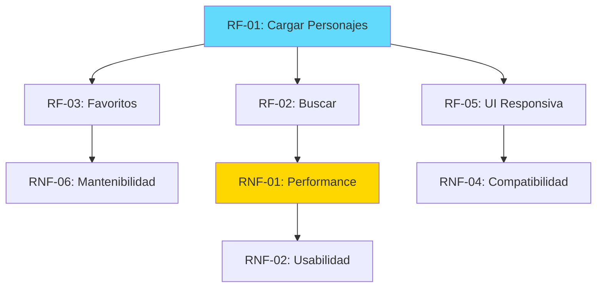

# Requerimientos del Sistema - Rick and Morty Explorer

**Proyecto:** myprojectapi03  
**Fecha:** 12 de Enero, 2026  
**Versión:** 1.0  

---

## 📋 Requerimientos Funcionales (RF)

### **RF-01: Gestión de Personajes**

| ID | Descripción | Prioridad | Estado |
|----|-------------|-----------|--------|
| RF-01.1 | El sistema DEBE cargar personajes desde la API de Rick and Morty | Alta | ✅ |
| RF-01.2 | El sistema DEBE mostrar imagen, nombre, especie y estado de cada personaje | Alta | ✅ |
| RF-01.3 | El sistema DEBE mostrar skeleton screens durante la carga | Media | ✅ |
| RF-01.4 | El sistema DEBE mostrar mensaje de error si la API falla | Alta | ✅ |
| RF-01.5 | El sistema DEBE permitir reintentar la carga en caso de error | Media | ✅ |

---

### **RF-02: Búsqueda y Filtrado**

| ID | Descripción | Prioridad | Estado |
|----|-------------|-----------|--------|
| RF-02.1 | El sistema DEBE permitir buscar personajes por nombre | Alta | ✅ |
| RF-02.2 | La búsqueda DEBE ser en tiempo real (sin botón "Buscar") | Media | ✅ |
| RF-02.3 | La búsqueda DEBE ser case-insensitive | Media | ✅ |
| RF-02.4 | El sistema DEBE mostrar mensaje cuando no hay resultados | Baja | ✅ |
| RF-02.5 | El sistema DEBE restaurar lista completa al borrar búsqueda | Media | ✅ |

---

### **RF-03: Sistema de Favoritos**

| ID | Descripción | Prioridad | Estado |
|----|-------------|-----------|--------|
| RF-03.1 | El sistema DEBE permitir agregar personajes a favoritos | Alta | ✅ |
| RF-03.2 | El sistema DEBE permitir quitar personajes de favoritos | Alta | ✅ |
| RF-03.3 | El sistema DEBE mostrar lista de favoritos separada | Media | ✅ |
| RF-03.4 | El sistema NO DEBE permitir duplicados en favoritos | Media | ✅ |
| RF-03.5 | El sistema DEBE diferenciar visualmente favoritos vs no-favoritos | Baja | ✅ |
| RF-03.6 | Los favoritos DEBEN persistir durante la sesión | Media | ✅ |
| RF-03.7 | Los favoritos NO DEBEN persistir entre sesiones | Baja | ✅ |

---

### **RF-04: Gestión de Tema**

| ID | Descripción | Prioridad | Estado |
|----|-------------|-----------|--------|
| RF-04.1 | El sistema DEBE soportar tema claro y oscuro | Media | ✅ |
| RF-04.2 | El sistema DEBE permitir alternar entre temas | Media | ✅ |
| RF-04.3 | El tema DEBE persistir en localStorage | Baja | ✅ |
| RF-04.4 | El cambio de tema DEBE ser instantáneo | Baja | ✅ |
| RF-04.5 | El sistema DEBE usar tema claro por defecto | Baja | ✅ |

---

### **RF-05: Interfaz de Usuario**

| ID | Descripción | Prioridad | Estado |
|----|-------------|-----------|--------|
| RF-05.1 | El sistema DEBE ser responsivo (mobile, tablet, desktop) | Alta | ✅ |
| RF-05.2 | El sistema DEBE usar grid responsivo para personajes | Alta | ✅ |
| RF-05.3 | El sistema DEBE mostrar animaciones de entrada | Baja | ✅ |
| RF-05.4 | El sistema DEBE tener header fijo | Baja | ✅ |
| RF-05.5 | El sistema DEBE usar iconos visuales (Heroicons) | Baja | ✅ |

---

## ⚙️ Requerimientos No Funcionales (RNF)

### **RNF-01: Performance**

| ID | Descripción | Objetivo | Estado |
|----|-------------|----------|--------|
| RNF-01.1 | First Contentful Paint (FCP) | < 1.5s | ✅ ~1.2s |
| RNF-01.2 | Time to Interactive (TTI) | < 3.0s | ✅ ~2.5s |
| RNF-01.3 | Bundle size (gzipped) | < 200KB | ✅ ~150KB |
| RNF-01.4 | Lighthouse Performance Score | > 90 | ✅ ~92 |
| RNF-01.5 | Uso de memoización para evitar re-renders | Implementado | ✅ |
| RNF-01.6 | Lazy loading de componentes | Implementado | ✅ |

**Estrategias de Optimización:**
- ✅ React.memo en componentes puros
- ✅ useMemo para cálculos costosos
- ✅ React.lazy para code splitting
- ✅ Vite para build optimizado

---

### **RNF-02: Usabilidad**

| ID | Descripción | Criterio | Estado |
|----|-------------|----------|--------|
| RNF-02.1 | Interfaz intuitiva sin necesidad de tutorial | Cumple | ✅ |
| RNF-02.2 | Feedback visual para todas las acciones | Cumple | ✅ |
| RNF-02.3 | Mensajes de error claros y accionables | Cumple | ✅ |
| RNF-02.4 | Tiempo de aprendizaje < 5 minutos | Cumple | ✅ |
| RNF-02.5 | Navegación sin confusiones | Cumple | ✅ |

---

### **RNF-03: Accesibilidad (A11y)**

| ID | Descripción | Estándar | Estado |
|----|-------------|----------|--------|
| RNF-03.1 | Uso de etiquetas ARIA en inputs | WCAG 2.1 AA | ✅ |
| RNF-03.2 | Contraste de colores adecuado | WCAG 2.1 AA | ✅ |
| RNF-03.3 | Navegación por teclado | WCAG 2.1 AA | ⚠️ Parcial |
| RNF-03.4 | Textos alternativos en imágenes | WCAG 2.1 AA | ✅ |
| RNF-03.5 | Estructura semántica HTML | WCAG 2.1 AA | ✅ |

**Mejoras Pendientes:**
- ⏳ Gestión de foco en modales (no hay modales actualmente)
- ⏳ Skip links para navegación
- ⏳ Anuncios de screen reader para cambios dinámicos

---

### **RNF-04: Compatibilidad**

| ID | Descripción | Soporte | Estado |
|----|-------------|---------|--------|
| RNF-04.1 | Chrome (últimas 2 versiones) | Requerido | ✅ |
| RNF-04.2 | Firefox (últimas 2 versiones) | Requerido | ✅ |
| RNF-04.3 | Safari (últimas 2 versiones) | Requerido | ✅ |
| RNF-04.4 | Edge (últimas 2 versiones) | Requerido | ✅ |
| RNF-04.5 | Mobile browsers (iOS Safari, Chrome Mobile) | Requerido | ✅ |
| RNF-04.6 | Internet Explorer 11 | No soportado | ❌ |

**Dispositivos:**
- ✅ Desktop (1920x1080 y superiores)
- ✅ Laptop (1366x768 y superiores)
- ✅ Tablet (768x1024)
- ✅ Mobile (375x667 mínimo)

---

### **RNF-05: Seguridad**

| ID | Descripción | Implementación | Estado |
|----|-------------|----------------|--------|
| RNF-05.1 | Protección contra XSS | React auto-escaping | ✅ |
| RNF-05.2 | HTTPS en producción | GitHub Pages | ✅ |
| RNF-05.3 | Validación de datos de API | PropTypes + try/catch | ✅ |
| RNF-05.4 | Sin dependencias con vulnerabilidades conocidas | npm audit | ✅ |
| RNF-05.5 | No uso de `dangerouslySetInnerHTML` | Code review | ✅ |

**Nota:** Al ser una aplicación cliente pura sin backend, no aplican:
- ❌ Autenticación/Autorización
- ❌ Tokens JWT
- ❌ Rate limiting
- ❌ SQL Injection (no hay DB)

---

### **RNF-06: Mantenibilidad**

| ID | Descripción | Métrica | Estado |
|----|-------------|---------|--------|
| RNF-06.1 | Código documentado con JSDoc | > 95% | ✅ 100% |
| RNF-06.2 | PropTypes en todos los componentes | 100% | ✅ |
| RNF-06.3 | Arquitectura Feature-Based | Implementada | ✅ |
| RNF-06.4 | Separación de responsabilidades | Cumple | ✅ |
| RNF-06.5 | Convenciones de naming consistentes | Cumple | ✅ |
| RNF-06.6 | Linting sin errores | 0 errores | ✅ |

---

### **RNF-07: Escalabilidad**

| ID | Descripción | Capacidad | Estado |
|----|-------------|-----------|--------|
| RNF-07.1 | Soportar hasta 100 personajes sin degradación | Cumple | ✅ |
| RNF-07.2 | Agregar nuevos features sin refactoring mayor | Arquitectura permite | ✅ |
| RNF-07.3 | Tiempo de búsqueda < 100ms con 100 personajes | Cumple (useMemo) | ✅ |
| RNF-07.4 | Memoria usada < 100MB | Cumple | ✅ |

---

### **RNF-08: Disponibilidad**

| ID | Descripción | SLA | Estado |
|----|-------------|-----|--------|
| RNF-08.1 | Uptime de GitHub Pages | 99.9% | ✅ |
| RNF-08.2 | Dependencia de API externa | Sin garantía | ⚠️ |
| RNF-08.3 | Manejo graceful de errores de API | Implementado | ✅ |
| RNF-08.4 | Funcionalidad offline | No soportada | ❌ |

**Nota:** La disponibilidad depende de:
1. GitHub Pages (hosting)
2. Rick and Morty API (datos)

---

### **RNF-09: SEO (Search Engine Optimization)**

| ID | Descripción | Implementación | Estado |
|----|-------------|----------------|--------|
| RNF-09.1 | Meta tags descriptivos | index.html | ✅ |
| RNF-09.2 | Título de página descriptivo | index.html | ✅ |
| RNF-09.3 | Estructura semántica HTML5 | Componentes | ✅ |
| RNF-09.4 | URLs amigables | SPA (limitado) | ⚠️ |
| RNF-09.5 | Sitemap.xml | No implementado | ❌ |

**Limitaciones SPA:**
- ⚠️ Sin Server-Side Rendering (SSR)
- ⚠️ Sin pre-rendering de rutas
- ⚠️ Contenido dinámico no indexable

---

### **RNF-10: Observabilidad**

| ID | Descripción | Herramienta | Estado |
|----|-------------|-------------|--------|
| RNF-10.1 | Logging centralizado | logger.js | ✅ |
| RNF-10.2 | Error tracking | Preparado para Sentry | ⏳ |
| RNF-10.3 | Analytics | No implementado | ❌ |
| RNF-10.4 | Performance monitoring | No implementado | ❌ |

---

## 🎯 Restricciones del Proyecto

### **Restricciones Técnicas:**

1. **Sin Backend Propio:**
   - ❌ No hay servidor backend
   - ❌ No hay base de datos
   - ✅ Arquitectura cliente pura
   - ✅ Dependencia de API externa

2. **Limitaciones de la API:**
   - Solo primera página de resultados (20 personajes)
   - Sin autenticación requerida
   - Rate limiting de la API (no controlado por nosotros)

3. **Persistencia:**
   - Favoritos NO persisten entre sesiones
   - Solo localStorage para tema
   - Sin sincronización entre dispositivos

4. **Navegación:**
   - SPA de una sola vista
   - Sin routing (React Router)
   - Sin deep linking

---

### **Restricciones de Negocio:**

1. **Alcance Limitado:**
   - Solo visualización de personajes
   - No edición de datos
   - No creación de contenido

2. **Dependencias Externas:**
   - Dependencia crítica de API de Rick and Morty
   - Sin plan de contingencia si API cae

3. **Monetización:**
   - No aplica (proyecto educativo/demo)

---

## 📊 Matriz de Priorización (MoSCoW)

### **Must Have (Debe Tener):**
- ✅ Visualizar personajes
- ✅ Buscar personajes
- ✅ Diseño responsivo
- ✅ Manejo de errores

### **Should Have (Debería Tener):**
- ✅ Sistema de favoritos
- ✅ Tema claro/oscuro
- ✅ Skeleton loading
- ✅ Animaciones

### **Could Have (Podría Tener):**
- ⏳ Paginación
- ⏳ Filtros avanzados
- ⏳ Detalles de personaje
- ⏳ Testing automatizado

### **Won't Have (No Tendrá - Esta Versión):**
- ❌ Autenticación
- ❌ Backend propio
- ❌ Persistencia de favoritos
- ❌ Compartir en redes sociales
- ❌ Modo offline

---

## 🔄 Dependencias entre Requerimientos

---

## ✅ Criterios de Aceptación Globales

### **Para Requerimientos Funcionales:**

1. **Completitud:**
   - ✅ Todas las funcionalidades descritas están implementadas
   - ✅ No hay funcionalidad parcial

2. **Corrección:**
   - ✅ Cada función se comporta según lo especificado
   - ✅ No hay bugs críticos

3. **Usabilidad:**
   - ✅ Interfaz intuitiva
   - ✅ Feedback visual claro

### **Para Requerimientos No Funcionales:**

1. **Performance:**
   - ✅ Métricas dentro de objetivos
   - ✅ Sin degradación perceptible

2. **Calidad de Código:**
   - ✅ Linting sin errores
   - ✅ Documentación completa
   - ✅ Arquitectura limpia

3. **Compatibilidad:**
   - ✅ Funciona en navegadores objetivo
   - ✅ Responsivo en dispositivos objetivo

---

## 📈 Roadmap Futuro (Fuera de Alcance Actual)

### **Versión 2.0 (Potencial):**

1. **Funcionalidades:**
   - Paginación de resultados
   - Filtros avanzados (especie, género, estado)
   - Vista de detalles de personaje
   - Compartir favoritos

2. **Técnico:**
   - Testing suite completa (80% coverage)
   - Error Boundaries
   - PWA capabilities
   - Server-Side Rendering (Next.js)

3. **UX/UI:**
   - Animaciones avanzadas
   - Modo offline
   - Notificaciones toast
   - Accesibilidad WCAG 2.1 AAA

---

**Fin de Requerimientos**

*Documento generado por: Arquitecto de Software Senior*  
*Fecha: 12 de Enero, 2026*  
*Versión: 1.0*
