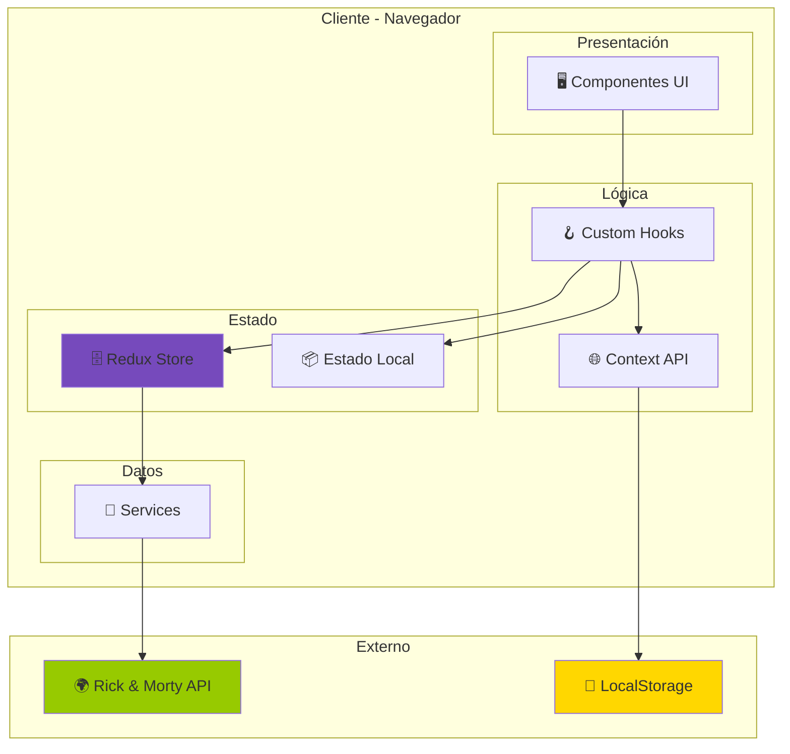
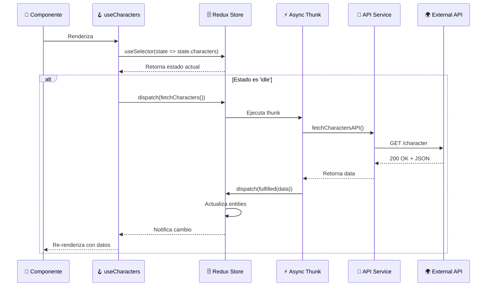
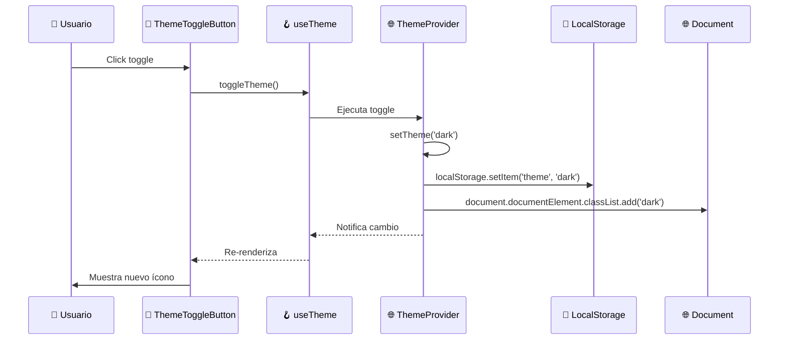
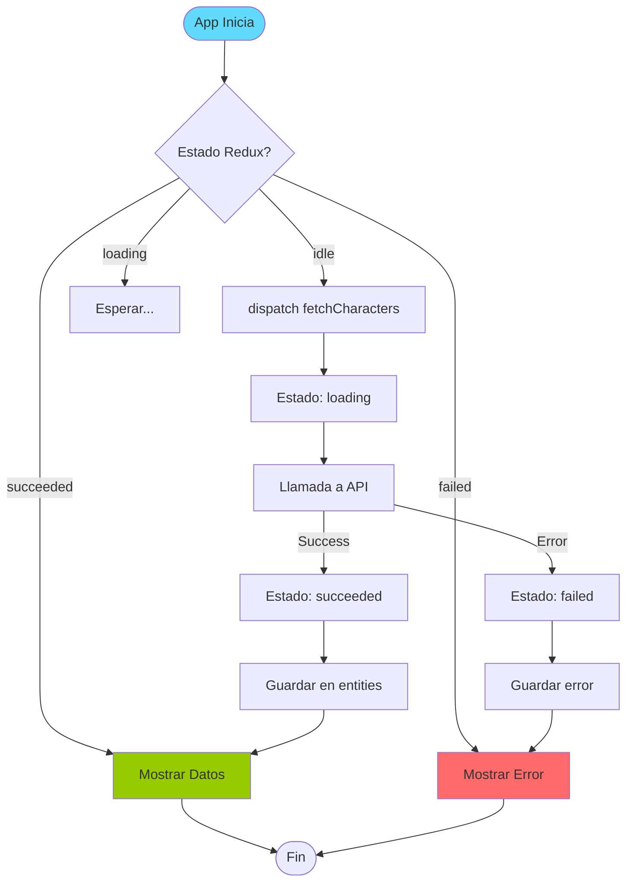
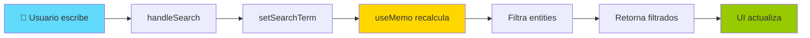
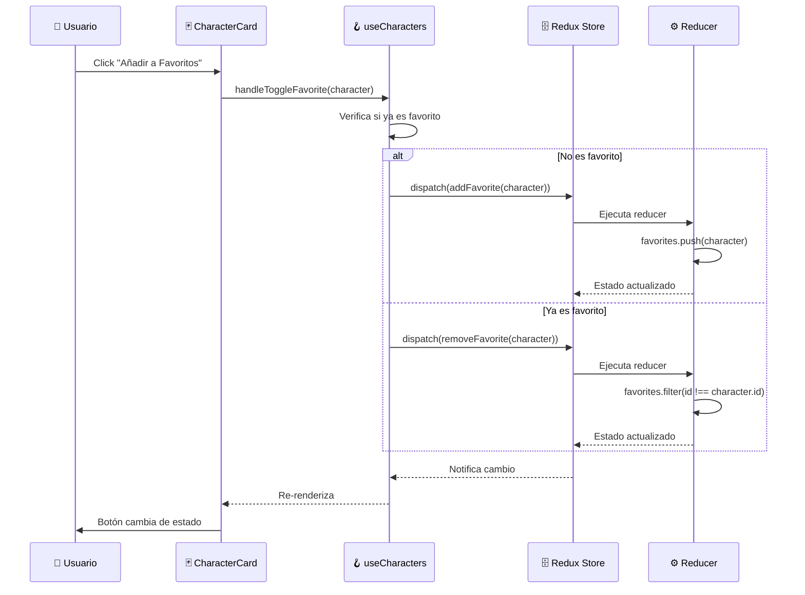
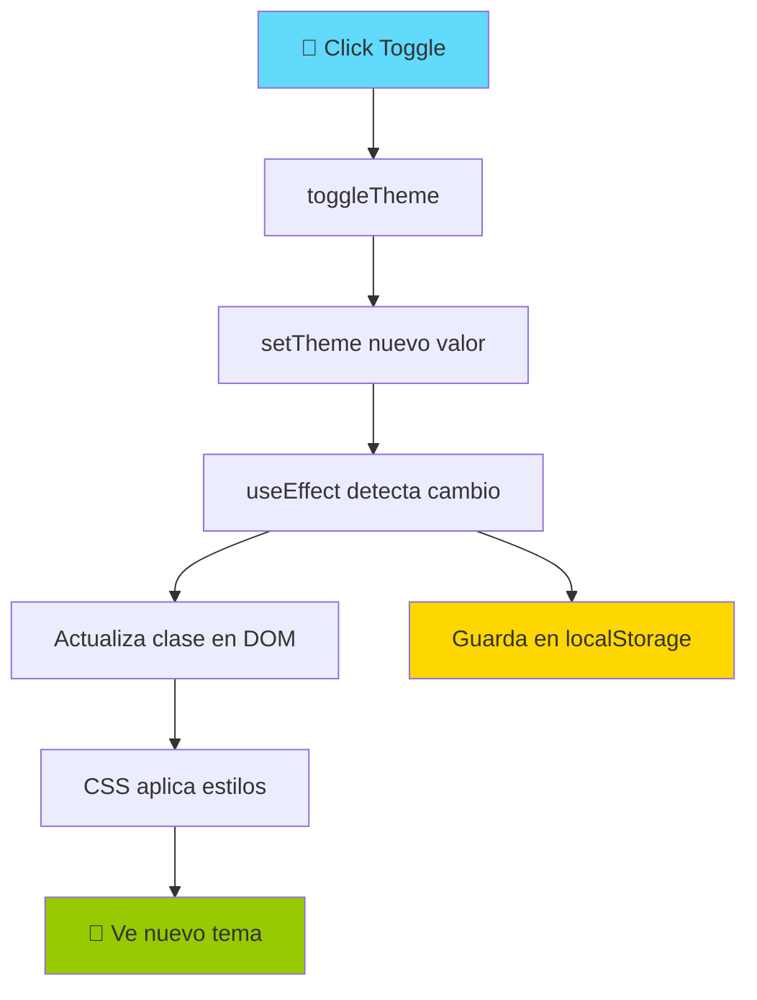
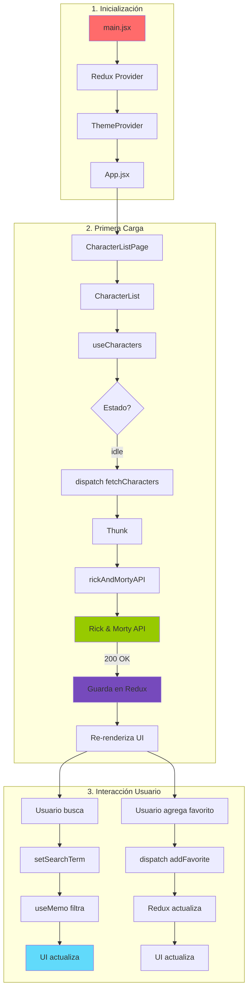

# Flujo de Datos - Rick and Morty Explorer

**Proyecto:** myprojectapi03  
**Arquitectura:** Cliente Pura (Sin Backend)  
**Fecha:** 12 de Enero, 2026  

---

## ⚠️ IMPORTANTE: Arquitectura Cliente Pura

Este proyecto utiliza una **arquitectura cliente pura** sin backend propio.  
El estado es completamente local/cliente y se gestiona mediante:

- **Redux Toolkit** para estado global de la aplicación
- **Context API** para estado de UI (tema)
- **LocalStorage** para persistencia limitada (solo tema)

### **No Aplica:**
- ❌ Integración con Firebase
- ❌ Servicios serverless
- ❌ Base de datos remota
- ❌ Backend Node.js/Express
- ❌ Autenticación/Autorización
- ❌ Sincronización entre dispositivos

### **Fuente de Datos:**
- ✅ **API Externa:** Rick and Morty API (solo lectura)
- ✅ **Estado Local:** Redux Store (en memoria)
- ✅ **Persistencia Mínima:** localStorage (solo tema)

---

## 🔄 Flujo de Datos General



---

## 📊 Arquitectura de Estado

### **1. Estado Global (Redux)**

**Responsabilidad:** Gestionar datos de negocio (personajes, favoritos)

**Estructura del Store:**

```javascript
{
  characters: {
    entities: [],      // Array de personajes de la API
    favorites: [],     // Array de personajes favoritos
    status: 'idle',    // 'idle' | 'loading' | 'succeeded' | 'failed'
    error: null        // Mensaje de error si falla
  }
}
```

**Flujo de Datos Redux:**



---

### **2. Estado Local (useState)**

**Responsabilidad:** Gestionar estado UI temporal (búsqueda)

**Ejemplo:**

```javascript
// En useCharacters.js
const [searchTerm, setSearchTerm] = useState("");

// Flujo:
// Usuario escribe → setSearchTerm → useMemo recalcula → UI actualiza
```

**Características:**
- ✅ No persiste (se pierde al recargar)
- ✅ Específico del componente
- ✅ Rápido (no pasa por Redux)

---

### **3. Estado de Contexto (Context API)**

**Responsabilidad:** Gestionar preferencias de UI (tema)

**Estructura:**

```javascript
{
  theme: 'light' | 'dark',
  toggleTheme: () => void
}
```

**Flujo de Datos Context:**



---

## 🔄 Flujos de Datos por Funcionalidad

### **Flujo 1: Carga Inicial de Personajes**



**Código:**

```javascript
// 1. Componente se monta
useEffect(() => {
  if (status === 'idle') {
    dispatch(fetchCharacters()); // Dispara thunk
  }
}, [status, dispatch]);

// 2. Thunk ejecuta
export const fetchCharacters = createAsyncThunk(
  'characters/fetchCharacters',
  async (_, { rejectWithValue }) => {
    try {
      const characters = await fetchCharactersAPI(); // Llama servicio
      return characters; // Retorna datos
    } catch (error) {
      return rejectWithValue(error.message); // Retorna error
    }
  }
);

// 3. Reducer actualiza estado
.addCase(fetchCharacters.fulfilled, (state, action) => {
  state.status = 'succeeded';
  state.entities = action.payload; // Guarda personajes
})
```

---

### **Flujo 2: Búsqueda de Personajes**



**Código:**

```javascript
// 1. Estado local
const [searchTerm, setSearchTerm] = useState("");

// 2. Handler
const handleSearch = (value) => {
  setSearchTerm(value); // Actualiza estado local
};

// 3. Memoización (optimización)
const filteredCharacters = useMemo(() => {
  if (!searchTerm) return entities; // Sin búsqueda, retorna todo
  
  return entities.filter((char) =>
    char.name.toLowerCase().includes(searchTerm.toLowerCase())
  );
}, [entities, searchTerm]); // Solo recalcula si cambian

// 4. UI consume
return <CharacterList characters={filteredCharacters} />;
```

**Características:**
- ✅ **Cliente-side filtering:** No hace peticiones a API
- ✅ **Optimizado:** useMemo evita recálculos innecesarios
- ✅ **Instantáneo:** No hay latencia de red

---

### **Flujo 3: Gestión de Favoritos**



**Código:**

```javascript
// 1. Hook verifica estado
const handleToggleFavorite = (character) => {
  const isFavorite = favorites.some((fav) => fav.id === character.id);
  
  if (isFavorite) {
    dispatch(removeFavorite(character)); // Quita
  } else {
    dispatch(addFavorite(character)); // Agrega
  }
};

// 2. Reducer sincrónico
reducers: {
  addFavorite: (state, action) => {
    const character = action.payload;
    const exists = state.favorites.find(fav => fav.id === character.id);
    if (!exists) {
      state.favorites.push(character); // Immer permite mutación
    }
  },
  removeFavorite: (state, action) => {
    const character = action.payload;
    state.favorites = state.favorites.filter(fav => fav.id !== character.id);
  },
}
```

**Persistencia:**
- ❌ **NO persiste:** Los favoritos se pierden al recargar
- ✅ **Solo en memoria:** Durante la sesión actual
- ⏳ **Futuro:** Podría persistir en localStorage

---

### **Flujo 4: Cambio de Tema**



**Código:**

```javascript
// 1. Estado inicial (lee de localStorage)
const [theme, setTheme] = useState(() => {
  const saved = localStorage.getItem('theme');
  return saved || 'light';
});

// 2. Efecto que sincroniza
useEffect(() => {
  const root = document.documentElement;
  root.classList.remove('light', 'dark');
  root.classList.add(theme); // Agrega clase al <html>
  localStorage.setItem('theme', theme); // Persiste
}, [theme]);

// 3. Toggle
const toggleTheme = () => {
  setTheme(prev => prev === 'light' ? 'dark' : 'light');
};
```

**Persistencia:**
- ✅ **Persiste:** En localStorage
- ✅ **Sobrevive recargas:** Se restaura al iniciar
- ✅ **Por dispositivo:** No sincroniza entre dispositivos

---

## 📦 Gestión de Estado: Redux vs Context vs Local

| Tipo de Dato | Solución | Persiste | Ejemplo |
|--------------|----------|----------|---------|
| **Datos de Negocio** | Redux | ❌ No | Personajes, Favoritos |
| **Estado UI Global** | Context | ✅ Sí (localStorage) | Tema |
| **Estado UI Local** | useState | ❌ No | Término de búsqueda |
| **Datos Derivados** | useMemo | ❌ No | Personajes filtrados |

---

## 🔌 Capa de Servicios (API)

### **Servicio: rickAndMortyAPI.js**

**Responsabilidad:** Abstraer comunicación con API externa

```javascript
const API_BASE_URL = "https://rickandmortyapi.com/api";

export const fetchCharacters = async () => {
  try {
    const response = await fetch(`${API_BASE_URL}/character`);
    
    if (!response.ok) {
      throw new Error(`HTTP error! status: ${response.status}`);
    }
    
    const data = await response.json();
    return data.results; // Solo retorna array de personajes
  } catch (error) {
    logger.apiError('/character', error); // Log centralizado
    throw error; // Re-lanza para que Redux lo maneje
  }
};
```

**Características:**
- ✅ **Abstracción:** Oculta detalles de fetch
- ✅ **Error Handling:** Maneja errores HTTP
- ✅ **Logging:** Usa logger centralizado
- ✅ **Normalización:** Retorna solo lo necesario

---

## 🔄 Flujo de Datos Completo (Diagrama Integrado)



---

## 💾 Persistencia de Datos

### **¿Qué se Persiste?**

| Dato | Método | Duración | Sincroniza |
|------|--------|----------|------------|
| **Tema** | localStorage | Permanente | ❌ No |
| **Favoritos** | Memoria (Redux) | Sesión actual | ❌ No |
| **Personajes** | Memoria (Redux) | Sesión actual | ❌ No |
| **Búsqueda** | Memoria (useState) | Componente montado | ❌ No |

### **¿Por qué no persisten los favoritos?**

**Decisión de Diseño:**
- ✅ Simplicidad: No requiere backend
- ✅ Privacidad: No se almacenan datos del usuario
- ⚠️ Limitación: Se pierden al recargar

**Alternativas Futuras:**
- ⏳ Persistir en localStorage
- ⏳ Sincronizar con backend (requiere implementar)
- ⏳ Usar IndexedDB para más capacidad

---

## 🚫 Lo que NO Hacemos (Arquitectura Cliente Pura)

### **No Hay Backend:**

```
❌ NO EXISTE:
┌─────────────────┐
│   Backend API   │
│   (Node.js)     │
└─────────────────┘
        ↓
┌─────────────────┐
│   Base de Datos │
│   (MongoDB)     │
└─────────────────┘
```

### **No Hay Autenticación:**

```
❌ NO EXISTE:
Usuario → Login → JWT Token → Requests Autenticados
```

### **No Hay Sincronización:**

```
❌ NO EXISTE:
Dispositivo A ←→ Backend ←→ Dispositivo B
```

---

## ✅ Lo que SÍ Hacemos

### **Arquitectura Real:**

```
✅ EXISTE:
┌─────────────────┐
│   Navegador     │
│   (Cliente)     │
├─────────────────┤
│ Redux Store     │ ← Estado en memoria
│ Context API     │ ← Tema en localStorage
│ useState        │ ← Estado local
└─────────────────┘
        ↓
┌─────────────────┐
│ Rick & Morty API│ ← Solo lectura
│ (Externa)       │
└─────────────────┘
```

---

## 🎯 Ventajas de Esta Arquitectura

1. **Simplicidad:**
   - Sin servidor que mantener
   - Sin base de datos que gestionar
   - Deployment estático simple

2. **Costo:**
   - Hosting gratuito (GitHub Pages)
   - Sin costos de backend
   - Sin costos de base de datos

3. **Performance:**
   - Todo en cliente (rápido)
   - Sin latencia de backend
   - Caching del navegador

4. **Escalabilidad:**
   - CDN de GitHub Pages
   - Sin límites de usuarios concurrentes
   - Sin carga en servidor propio

---

## ⚠️ Limitaciones de Esta Arquitectura

1. **Persistencia:**
   - Datos se pierden al recargar
   - No sincroniza entre dispositivos
   - Limitado a localStorage

2. **Seguridad:**
   - Sin autenticación
   - Sin autorización
   - Datos públicos

3. **Funcionalidad:**
   - Solo lectura de API externa
   - No puede crear/editar/eliminar en API
   - Dependiente de API externa

4. **SEO:**
   - SPA sin SSR
   - Contenido dinámico no indexable
   - Limitaciones de crawlers

---

**Fin del Flujo de Datos**

*Documento generado por: Arquitecto de Software Senior*  
*Fecha: 12 de Enero, 2026*  
*Versión: 1.0*
