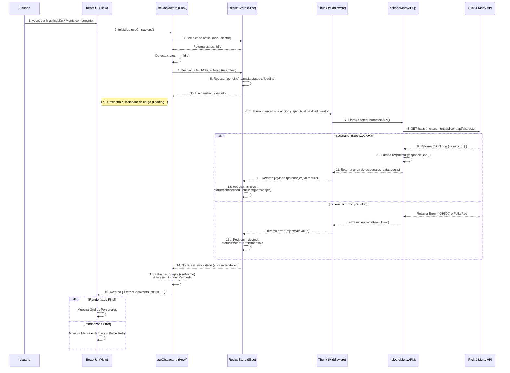

# 3.2. Flujo de Datos

**Fecha:** 31/12/2025
**Versión:** 1.0

Este documento describe el flujo de datos principal de la aplicación, centrándose en el ciclo de vida de la obtención de personajes.

## 1. Diagrama de Secuencia

El siguiente diagrama ilustra la interacción entre las diferentes capas de la aplicación cuando un usuario carga la página por primera vez.

## 2. Descripción del Flujo

1.  **Inicio:** El usuario carga la aplicación. El componente de página (ej. `CharacterListPage`) se monta.
2.  **Lógica de UI (Hook):** El componente de página invoca al hook `useCharacters`.
3.  **Disparo de Carga:** Dentro de un `useEffect`, el hook `useCharacters` despacha la acción asíncrona `fetchCharacters` (creada con `createAsyncThunk`) porque detecta que el estado inicial es `idle`.
4.  **Estado de Carga:** El `characterSlice` de Redux responde a la acción `.pending`, cambiando el estado de `status` a `loading`. La UI reacciona a este cambio y muestra un esqueleto de carga.
5.  **Llamada a la API:** El middleware Thunk ejecuta la lógica de la acción: llama a la función del servicio (`rickAndMortyAPI.js`), que a su vez realiza la petición `fetch` a la API externa.
6.  **Resolución de la Petición:**
    -   **Éxito:** La API devuelve los datos. La acción se completa con el estado `.fulfilled`. El `characterSlice` guarda los personajes en el store y cambia el `status` a `succeeded`.
    -   **Error:** La petición falla. La acción se completa con el estado `.rejected`. El `characterSlice` guarda el mensaje de error y cambia el `status` a `failed`.
7.  **Renderizado Final:** El componente de página recibe el nuevo estado desde el hook `useCharacters` (que usa `useSelector`). La UI se actualiza para mostrar la lista de personajes o un mensaje de error, según corresponda.
